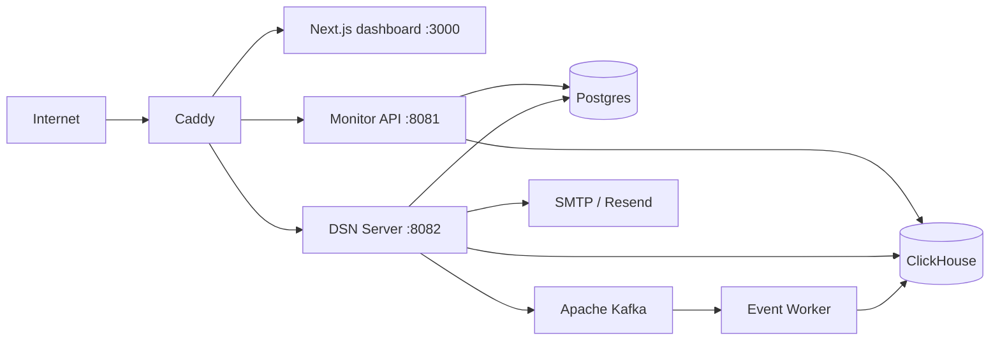

English | [中文](./DEPLOYMENT.zh-CN.md)

# Condev Monitor Deployment Guide

This guide documents the deployment paths that are actually present in the repository: local infrastructure compose, full self-hosted stack, and the optional Cloudflare deployment path for the frontend.

## Table of Contents

- [Deployment Modes](#deployment-modes)
- [Full Stack Topology](#full-stack-topology)
- [Prerequisites](#prerequisites)
- [Prepare Environment Variables](#prepare-environment-variables)
- [Full Stack Deployment](#full-stack-deployment)
- [Caddy Route Mapping](#caddy-route-mapping)
- [Kafka Topics](#kafka-topics)
- [Runtime Volumes and Data](#runtime-volumes-and-data)
- [Ingest Pipeline](#ingest-pipeline)
- [Operational Notes](#operational-notes)
- [Cloudflare Frontend Deployment](#cloudflare-frontend-deployment)

---

## Deployment Modes

| Mode                     | What it runs                                                                   | Files                                                                               |
| ------------------------ | ------------------------------------------------------------------------------ | ----------------------------------------------------------------------------------- |
| Local infra only         | ClickHouse + Postgres + Kafka                                                  | `.devcontainer/docker-compose.yml`, `scripts/init-kafka-topics.sh`                  |
| Full self-hosted stack   | Caddy + frontend + all backends + event worker + ClickHouse + Postgres + Kafka | `.devcontainer/docker-compose.deply.yml`                                            |
| Frontend-only Cloudflare | Next.js dashboard only                                                         | `apps/frontend/monitor/open-next.config.ts`, `apps/frontend/monitor/wrangler.jsonc` |

---

## Full Stack Topology



The full stack starts these services:

- `condev-monitor-clickhouse`
- `condev-monitor-postgres`
- `condev-monitor-kafka`
- `condev-monitor-kafka-init`
- `condev-monitor-server`
- `condev-dsn-server`
- `condev-monitor-event-worker`
- `condev-monitor-web`
- `condev-monitor-caddy`

---

## Prerequisites

- Docker + Docker Compose
- Node.js `22.15+`
- pnpm `10.10.0`
- a public domain if you want HTTPS through Caddy

---

## Prepare Environment Variables

Copy the deployment env template:

```bash
cp .devcontainer/.env.example .devcontainer/.env
```

The deployment compose injects variables from `.devcontainer/.env` into ClickHouse, Postgres, the monitor backend, the dsn-server, the frontend, and Caddy.

### Variables You Should Always Review

| Variable                                                      | Why it matters                                    |
| ------------------------------------------------------------- | ------------------------------------------------- |
| `DB_USERNAME`, `DB_PASSWORD`, `DB_DATABASE`                   | Postgres bootstrap and backend connection         |
| `CLICKHOUSE_USERNAME`, `CLICKHOUSE_PASSWORD`, `CLICKHOUSE_DB` | ClickHouse bootstrap and backend connection       |
| `FRONTEND_URL`                                                | Email links and frontend base URL                 |
| `MAIL_ON`                                                     | Enables or disables actual email flow             |
| `RESEND_API_KEY`, `RESEND_FROM`                               | Resend mail mode                                  |
| `EMAIL_SENDER`, `EMAIL_SENDER_PASSWORD`                       | SMTP mail mode                                    |
| `AUTH_REQUIRE_EMAIL_VERIFICATION`                             | Controls whether login requires verified email    |
| `DSN_BODY_LIMIT`                                              | dsn-server request size limit                     |
| `CADDY_DSN_MAX_BODY_SIZE`                                     | reverse-proxy request size limit                  |
| `CLICKHOUSE_MAX_HTTP_BODY_SIZE`                               | ClickHouse write limit                            |
| `SOURCEMAP_CACHE_MAX`, `SOURCEMAP_CACHE_TTL_MS`               | sourcemap resolution cache controls               |
| `INGEST_MODE`                                                 | `kafka` or `direct`, controls DSN ingest pipeline |
| `KAFKA_BROKERS`                                               | Broker addresses for DSN and event worker         |
| `KAFKA_CONSUMER_GROUP`                                        | Consumer group for event worker                   |
| `EMBEDDING_MODEL_ID`                                          | HuggingFace model for issue embeddings            |
| `LLM_PROVIDER`, `LLM_BASE_URL`, `LLM_API_KEY`, `LLM_MODEL`    | LLM integration for issue analysis                |

### Ports Exposed by the Compose

| Variable                 | Default |
| ------------------------ | ------- |
| `CADDY_HTTP_HOST_PORT`   | `80`    |
| `CADDY_HTTPS_HOST_PORT`  | `443`   |
| `POSTGRES_PORT`          | `5432`  |
| `CLICKHOUSE_HTTP_PORT`   | `8123`  |
| `CLICKHOUSE_NATIVE_PORT` | `9000`  |
| `KAFKA_EXTERNAL_PORT`    | `9094`  |

### Caddy Domain

Edit `.devcontainer/caddy/Caddyfile`.

The committed file currently uses:

```text
monitor.condevtools.com
```

Change that to your own domain before production use.

---

## Full Stack Deployment

### 1. Build and start

```bash
pnpm docker:deploy
```

This command:

1. runs `docker compose -p condev-monitor -f .devcontainer/docker-compose.deply.yml up -d --build`
2. runs `pnpm docker:init-clickhouse`
3. runs `pnpm docker:init-kafka`

Important note: the file name in the repository is literally `docker-compose.deply.yml`. The root script already uses that exact path.

### 2. Stop the stack

```bash
pnpm docker:deploy:stop
```

### 3. Verify the main routes

After the containers are up, verify:

- `/` -> dashboard
- `/api/*` -> monitor backend
- `/dsn-api/*` -> dsn-server
- `/tracking/*` -> dsn-server
- `/replay/*` -> dsn-server
- `/app-config` -> dsn-server

### 4. Local infra only

If you only want databases and Kafka locally:

```bash
pnpm docker:start
pnpm docker:stop
```

`pnpm docker:start` starts ClickHouse, Postgres, and Kafka, then runs init scripts for both ClickHouse and Kafka topics. `pnpm docker:stop` stops all three. This uses `.devcontainer/docker-compose.yml`.

---

## Caddy Route Mapping

The committed Caddyfile routes:

- `/api/*` -> `condev-monitor-server:8081`
- `/dsn-api/*` -> `condev-dsn-server:8082`
- `/app-config` -> `condev-dsn-server:8082`
- `/tracking/*` -> `condev-dsn-server:8082`
- `/replay/*` -> `condev-dsn-server:8082`
- `/span` -> `condev-dsn-server:8082`
- everything else -> `condev-monitor-web:3000`

Both `/dsn-api/*` and the direct ingestion routes enforce `CADDY_DSN_MAX_BODY_SIZE`.

---

## Kafka Topics

The `scripts/init-kafka-topics.sh` script creates these topics (idempotent):

| Topic                    | Partitions | Retention | Purpose                                        |
| ------------------------ | ---------- | --------- | ---------------------------------------------- |
| `monitor.sdk.events.v1`  | 6          | 3 days    | SDK events from DSN server to event worker     |
| `monitor.sdk.replays.v1` | 3          | 1 day     | Replay uploads from DSN server to event worker |
| `monitor.sdk.dlq.v1`     | 1          | 7 days    | Dead letter queue for failed processing        |

---

## Runtime Volumes and Data

The full stack compose defines these named volumes:

- `clickhouse_data`
- `postgres_data`
- `sourcemap_data`
- `kafka_data`
- `caddy_data`
- `caddy_config`

What they store:

- `clickhouse_data` -> ClickHouse event data
- `postgres_data` -> users, applications, sourcemap metadata, sourcemap tokens
- `sourcemap_data` -> actual sourcemap files shared by monitor backend and dsn-server
- `kafka_data` -> Kafka broker data and topic partitions
- `caddy_data`, `caddy_config` -> Caddy state and TLS data

The shipped ClickHouse schema also:

- creates `lemonade.base_monitor_storage`
- creates `lemonade.base_monitor_view`
- creates `lemonade.app_settings`
- creates `lemonade.events`
- creates `lemonade.events_to_legacy_mv`
- creates `lemonade.issues`
- creates `lemonade.issue_embeddings`
- creates `lemonade.cron_locks`
- non-replay events have a 90-day TTL
- replay rows have a 30-day TTL

---

## Ingest Pipeline

The default deploy mode uses Kafka as the ingest buffer:

1. Browser SDK posts events to DSN server
2. DSN server applies rate limiting and inbound filtering
3. DSN server publishes validated events to Kafka topics
4. Event Worker consumes batches from Kafka
5. Event Worker performs fingerprinting and embedding-based issue dedup
6. Event Worker batch-inserts into ClickHouse `events` table
7. A materialized view (`events_to_legacy_mv`) mirrors writes to `base_monitor_storage` for backward compatibility

Setting `INGEST_MODE=direct` in the DSN server bypasses Kafka and writes directly to ClickHouse. This is useful for local development or as a fallback when Kafka is unavailable (`KAFKA_FALLBACK_TO_CLICKHOUSE=true`).

---

## Operational Notes

### Port behavior

- `apps/backend/monitor` currently listens on fixed port `8081`
- `apps/backend/dsn-server` listens on `PORT`, default `8082`
- `apps/frontend/monitor` listens on `3000`
- `apps/backend/event-worker` listens internally (no exposed port, Kafka consumer only)

### Replay upload size

Replay uploads are limited by three layers:

1. `CADDY_DSN_MAX_BODY_SIZE`
2. `DSN_BODY_LIMIT`
3. `CLICKHOUSE_MAX_HTTP_BODY_SIZE`

If replay payloads start failing with `413` or write errors, these are the first knobs to inspect.

### Mail mode

Runtime mail behavior is:

1. `MAIL_ON=false` -> no real delivery
2. `MAIL_ON=true` + `RESEND_API_KEY` -> Resend
3. `MAIL_ON=true` + SMTP credentials -> SMTP
4. otherwise -> JSON transport / warning-only fallback

### Shared sourcemap path

The full stack compose mounts `SOURCEMAP_STORAGE_DIR` into both backends using the same `sourcemap_data` volume. If one service can see sourcemaps but the other cannot, check that shared mount first.

---

## Cloudflare Frontend Deployment

The dashboard package includes OpenNext Cloudflare support:

```bash
pnpm --filter @condev-monitor/monitor-client deploy
pnpm --filter @condev-monitor/monitor-client preview
```

Relevant files:

- `apps/frontend/monitor/open-next.config.ts`
- `apps/frontend/monitor/wrangler.jsonc`

Important caveat:

- if Cloudflare proxies your upload endpoints, large replay payloads may hit `413`
- a common production layout is to keep the frontend on Cloudflare while routing `/tracking` and `/replay` to a non-proxied subdomain or separate origin
