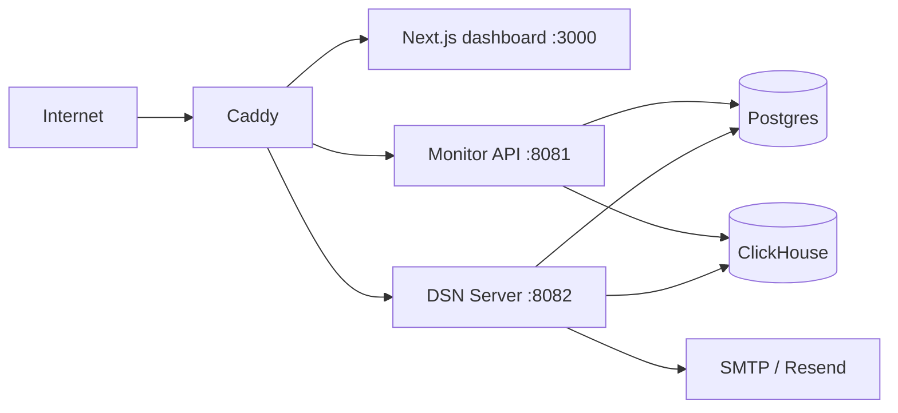

[English](./DEPLOYMENT.md) | 中文

# Condev Monitor 部署指南

这份文档只讲仓库里真实存在的部署路径：本地基础设施 compose、自托管整栈部署，以及前端单独上 Cloudflare 的可选方案。

## 目录

- [部署模式](#部署模式)
- [整栈拓扑](#整栈拓扑)
- [前置要求](#前置要求)
- [准备环境变量](#准备环境变量)
- [整栈部署](#整栈部署)
- [Caddy 路由规则](#caddy-路由规则)
- [数据卷与运行时数据](#数据卷与运行时数据)
- [运维注意事项](#运维注意事项)
- [Cloudflare 前端部署](#cloudflare-前端部署)

---

## 部署模式

| 模式                  | 启动内容                                        | 文件                                                                                |
| --------------------- | ----------------------------------------------- | ----------------------------------------------------------------------------------- |
| 本地基础设施          | ClickHouse + Postgres                           | `.devcontainer/docker-compose.yml`                                                  |
| 自托管整栈            | Caddy + 前端 + 两个后端 + ClickHouse + Postgres | `.devcontainer/docker-compose.deply.yml`                                            |
| 前端单独上 Cloudflare | 仅 Next.js 控制台                               | `apps/frontend/monitor/open-next.config.ts`、`apps/frontend/monitor/wrangler.jsonc` |

---

## 整栈拓扑



整栈 compose 实际会启动：

- `condev-monitor-clickhouse`
- `condev-monitor-postgres`
- `condev-monitor-server`
- `condev-dsn-server`
- `condev-monitor-web`
- `condev-monitor-caddy`

---

## 前置要求

- Docker + Docker Compose
- Node.js `22.15+`
- pnpm `10.10.0`
- 如果要用 Caddy 跑 HTTPS，需要公网域名

---

## 准备环境变量

先复制部署模板：

```bash
cp .devcontainer/.env.example .devcontainer/.env
```

整栈 compose 会把 `.devcontainer/.env` 里的变量分别注入 ClickHouse、Postgres、monitor backend、dsn-server、frontend 和 Caddy。

### 一定要检查的变量

| 变量                                                          | 为什么重要                          |
| ------------------------------------------------------------- | ----------------------------------- |
| `DB_USERNAME`, `DB_PASSWORD`, `DB_DATABASE`                   | Postgres 初始化和后端连接都依赖它   |
| `CLICKHOUSE_USERNAME`, `CLICKHOUSE_PASSWORD`, `CLICKHOUSE_DB` | ClickHouse 初始化和后端连接都依赖它 |
| `FRONTEND_URL`                                                | 邮件里的链接和前端公网地址          |
| `MAIL_ON`                                                     | 控制是否真的发邮件                  |
| `RESEND_API_KEY`, `RESEND_FROM`                               | Resend 邮件模式                     |
| `EMAIL_SENDER`, `EMAIL_SENDER_PASSWORD`                       | SMTP 邮件模式                       |
| `AUTH_REQUIRE_EMAIL_VERIFICATION`                             | 控制登录前是否必须验证邮箱          |
| `DSN_BODY_LIMIT`                                              | dsn-server 请求体上限               |
| `CADDY_DSN_MAX_BODY_SIZE`                                     | 反向代理层请求体上限                |
| `CLICKHOUSE_MAX_HTTP_BODY_SIZE`                               | ClickHouse 写入上限                 |
| `SOURCEMAP_CACHE_MAX`, `SOURCEMAP_CACHE_TTL_MS`               | sourcemap 解析缓存控制              |

### compose 暴露的宿主机端口

| 变量                     | 默认值 |
| ------------------------ | ------ |
| `CADDY_HTTP_HOST_PORT`   | `80`   |
| `CADDY_HTTPS_HOST_PORT`  | `443`  |
| `POSTGRES_PORT`          | `5432` |
| `CLICKHOUSE_HTTP_PORT`   | `8123` |
| `CLICKHOUSE_NATIVE_PORT` | `9000` |

### Caddy 域名

部署前请修改 `.devcontainer/caddy/Caddyfile`。

仓库当前提交的域名是：

```text
monitor.condevtools.com
```

请换成你自己的域名。

---

## 整栈部署

### 1. 构建并启动

```bash
pnpm docker:deploy
```

这个命令会：

1. 执行 `docker compose -p condev-monitor -f .devcontainer/docker-compose.deply.yml up -d --build`
2. 执行 `pnpm docker:init-clickhouse`

注意：仓库里的文件名就是 `docker-compose.deply.yml`，虽然看起来像拼写错误，但根脚本已经按这个名字写死了。

### 2. 停止整栈

```bash
pnpm docker:deploy:stop
```

### 3. 验证核心路径

容器启动后，建议至少验证：

- `/` -> 控制台
- `/api/*` -> monitor backend
- `/dsn-api/*` -> dsn-server
- `/tracking/*` -> dsn-server
- `/replay/*` -> dsn-server
- `/app-config` -> dsn-server

### 4. 只启动本地基础设施

如果你只想在本地拉起数据库：

```bash
pnpm docker:start
pnpm docker:init-clickhouse
pnpm docker:stop
```

这条链路会使用 `.devcontainer/docker-compose.yml`，只启动 ClickHouse 和 Postgres。

---

## Caddy 路由规则

仓库当前提交的 Caddyfile 会这样转发：

- `/api/*` -> `condev-monitor-server:8081`
- `/dsn-api/*` -> `condev-dsn-server:8082`
- `/app-config` -> `condev-dsn-server:8082`
- `/tracking/*` -> `condev-dsn-server:8082`
- `/replay/*` -> `condev-dsn-server:8082`
- `/span` -> `condev-dsn-server:8082`
- 其他路径 -> `condev-monitor-web:3000`

其中 `/dsn-api/*` 和直接上报相关路径都会受 `CADDY_DSN_MAX_BODY_SIZE` 限制。

---

## 数据卷与运行时数据

整栈 compose 定义了这些 named volumes：

- `clickhouse_data`
- `postgres_data`
- `sourcemap_data`
- `caddy_data`
- `caddy_config`

它们分别保存：

- `clickhouse_data` -> ClickHouse 事件数据
- `postgres_data` -> 用户、应用、sourcemap 元数据、sourcemap token
- `sourcemap_data` -> sourcemap 文件本体，供两个后端共享
- `caddy_data`、`caddy_config` -> Caddy 状态和 TLS 数据

默认 ClickHouse 初始化脚本还会：

- 创建 `lemonade.base_monitor_storage`
- 创建 `lemonade.base_monitor_view`
- 创建 `lemonade.app_settings`
- 对 `replay` 行设置 30 天 TTL

---

## 运维注意事项

### 端口行为

- `apps/backend/monitor` 当前固定监听 `8081`
- `apps/backend/dsn-server` 监听 `PORT`，默认 `8082`
- `apps/frontend/monitor` 监听 `3000`

### Replay 上传体积

Replay 上传会同时受 3 层限制：

1. `CADDY_DSN_MAX_BODY_SIZE`
2. `DSN_BODY_LIMIT`
3. `CLICKHOUSE_MAX_HTTP_BODY_SIZE`

如果开始出现 `413` 或写入失败，优先检查这 3 个参数。

### 邮件模式

当前运行时邮件行为是：

1. `MAIL_ON=false` -> 不真实投递
2. `MAIL_ON=true` 且设置 `RESEND_API_KEY` -> Resend
3. `MAIL_ON=true` 且设置 SMTP 凭证 -> SMTP
4. 否则 -> JSON transport / 只打印 warning

### Sourcemap 共享路径

整栈 compose 用同一个 `sourcemap_data` volume 挂载 `SOURCEMAP_STORAGE_DIR` 到两个后端。如果一个服务能看到 sourcemap、另一个看不到，优先检查这个共享挂载。

---

## Cloudflare 前端部署

控制台集成了 OpenNext Cloudflare：

```bash
pnpm --filter @condev-monitor/monitor-client deploy
pnpm --filter @condev-monitor/monitor-client preview
```

相关文件：

- `apps/frontend/monitor/open-next.config.ts`
- `apps/frontend/monitor/wrangler.jsonc`

重要注意事项：

- 如果 Cloudflare 代理了上传接口，较大的 Replay payload 很容易命中 `413`
- 更常见的生产布局是前端走 Cloudflare，而 `/tracking`、`/replay` 走不经代理的子域或单独源站
