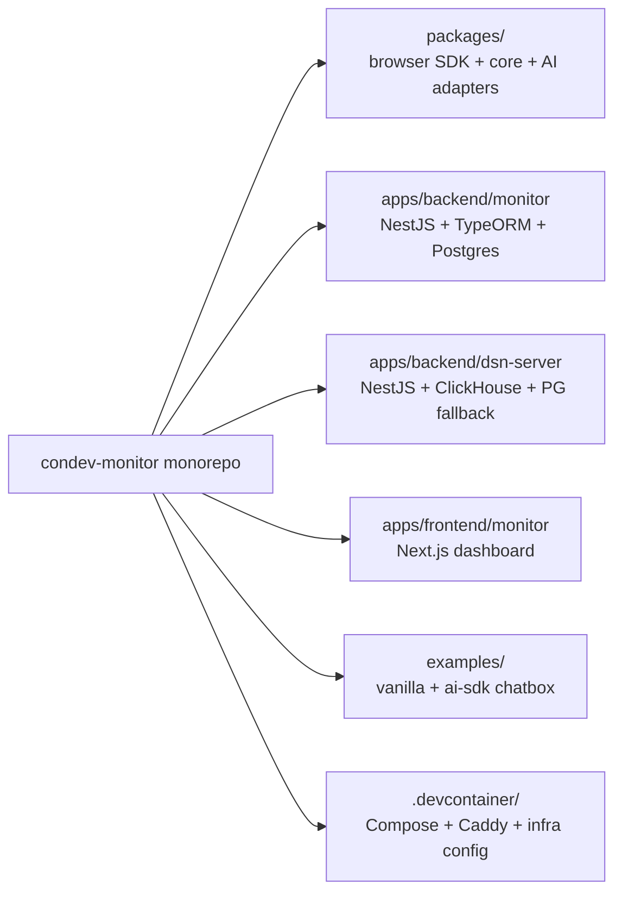
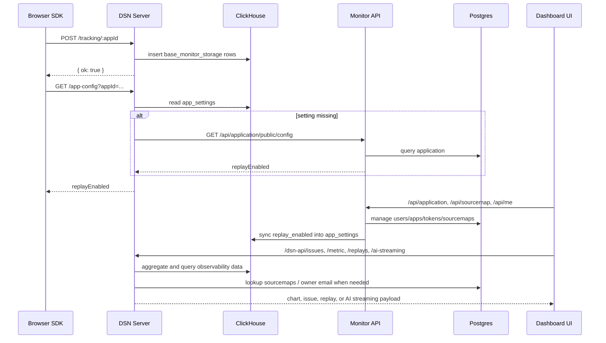

English | [中文](./README.zh-CN.md)

# Condev Monitor

Condev Monitor is a self-hosted frontend observability platform in a `pnpm` monorepo. It includes:

- a browser SDK for error, performance, white-screen, replay, and AI streaming capture
- a DSN ingestion and query service backed by ClickHouse
- a monitor management API backed by Postgres
- a Next.js dashboard for applications, issues, metrics, replays, and AI streaming traces

## Table of Contents

- [Features](#features)
- [Architecture](#architecture)
- [Tech Stack](#tech-stack)
- [Project Structure](#project-structure)
- [Local Development](#local-development)
- [Environment Variables](#environment-variables)
- [SDK Integration](#sdk-integration)
- [API Surface](#api-surface)
- [Additional Docs](#additional-docs)
- [Publishing SDK Packages](#publishing-sdk-packages)
- [License](#license)

---

## Features

**Browser Monitoring**

- JavaScript runtime errors, resource loading errors, and unhandled promise rejections
- Web Vitals plus runtime performance signals: `longTask`, `jank`, `lowFps`
- White-screen detection with startup polling and optional mutation-based runtime watch
- Custom message and custom event capture APIs
- Error-triggered minimal session replay with `rrweb`
- Batched transport, immediate flush for high-priority events, retry, and offline persistence

**Application & Source Maps**

- Application management with per-app replay toggle
- Sourcemap upload and lookup by `appId + release + dist + minifiedUrl`
- Sourcemap token issuance and revocation for CI/CD uploads
- Stack trace resolution on issue detail queries

**Dashboard**

- Application overview page
- Bug aggregation and recent error event inspection
- Metric charts and percentile summaries
- Replay list and replay player
- AI streaming trace dashboard with TTFB, TTLB, stalls, token usage, and model/provider info

**Operational Features**

- Aggregated error alert emails with a 5-minute per-app throttle
- Self-hosted Docker Compose deployment with ClickHouse, Postgres, Caddy, both backends, and the frontend
- Optional frontend-only deployment via OpenNext + Cloudflare

---

## Architecture

### Repository Topology



### High-Level Runtime Flow

```mermaid
graph TB
    subgraph Client Apps
        APP[Web app]
        SDK[@condev-monitor/monitor-sdk-browser]
        AI[@condev-monitor/monitor-sdk-ai]
    end

    subgraph Dashboard
        FE[Next.js dashboard]
    end

    subgraph Backend Services
        MON[Monitor API<br/>/api/*]
        DSN[DSN Server<br/>/dsn-api/* + /tracking/* + /replay/*]
    end

    subgraph Data Stores
        PG[(Postgres)]
        CH[(ClickHouse)]
    end

    subgraph Integrations
        MAIL[SMTP / Resend]
        CADDY[Caddy reverse proxy]
    end

    APP --> SDK
    SDK -->|POST tracking/replay| DSN
    AI -->|semantic ai_streaming events| DSN
    FE -->|/api/* rewrite| MON
    FE -->|/dsn-api/* rewrite| DSN
    MON --> PG
    MON --> CH
    DSN --> CH
    DSN --> PG
    DSN --> MAIL
    CADDY --> FE
    CADDY --> MON
    CADDY --> DSN
```

### Request and Data Flow



### Architecture Notes from the Current Code

- The dashboard never calls backend services directly from the browser by host/port; it uses Next.js rewrites:
    - `/api/*` -> `API_PROXY_TARGET` -> monitor backend
    - `/dsn-api/*` -> `DSN_API_PROXY_TARGET` -> dsn-server
- Browser replay enablement is per application. The browser SDK calls `GET /app-config?appId=...` before turning replay on.
- The monitor backend writes replay settings into ClickHouse `lemonade.app_settings`; the DSN server uses that as the fast path and falls back to the monitor API when needed.
- The DSN ClickHouse schema creates:
    - `lemonade.base_monitor_storage`
    - `lemonade.base_monitor_view`
    - `lemonade.app_settings`
- Replay rows have a ClickHouse TTL of 30 days in the shipped schema. Other event retention is not capped by the default schema.
- The frontend auth flow stores the monitor backend JWT in an HTTP-only cookie named `session_token` through Next route handlers under `app/auth-session/*`.

---

## Tech Stack

| Layer           | Technology                                                  |
| --------------- | ----------------------------------------------------------- |
| Runtime         | Node.js 22                                                  |
| Package manager | pnpm 10 + Turbo                                             |
| Dashboard       | Next.js 15, React 19, React Query, Tailwind CSS 4, Radix UI |
| Monitor backend | NestJS 11, TypeORM, Passport JWT, Postgres                  |
| DSN backend     | NestJS 11, ClickHouse, `pg` pool, Handlebars mail templates |
| Browser SDK     | TypeScript, `tsup`, `rrweb`, custom transport/offline queue |
| AI tracing      | OpenTelemetry span processor adapter for Vercel AI SDK      |
| Infra           | Docker, Docker Compose, Caddy, OpenNext Cloudflare optional |

Note: the active runtime path for `apps/backend/monitor` is TypeORM. A Prisma schema exists in the repository, but it is not used by the current Nest bootstrap path.

---

## Project Structure

```text
condev-monitor/
├── apps/
│   ├── backend/
│   │   ├── monitor/                # Auth, users, apps, sourcemaps, replay toggle sync
│   │   └── dsn-server/             # DSN ingestion, ClickHouse queries, alerts, replay fetch
│   └── frontend/
│       └── monitor/                # Next.js dashboard + rrweb player
├── packages/
│   ├── core/                       # Core monitoring primitives and capture helpers
│   ├── browser/                    # Browser SDK
│   ├── browser-utils/              # Metrics helpers / Web Vitals helpers
│   └── ai/                         # AI semantic monitoring adapters
├── examples/
│   ├── vanilla/                    # Vite example with browser SDK and sourcemap scripts
│   └── aisdk-rag-chatbox/          # Next.js example with browser + AI SDK tracing
├── .devcontainer/
│   ├── docker-compose.yml          # Local infra only: ClickHouse + Postgres
│   ├── docker-compose.deply.yml    # Full stack deploy file used by root scripts
│   ├── caddy/                      # Reverse proxy config
│   └── clickhouse/                 # ClickHouse init SQL and config overrides
├── scripts/
│   └── init-clickhouse.sh          # Initializes ClickHouse schema inside the deploy compose
├── README.md
└── README.zh-CN.md
```

### Workspace Notes

- `pnpm-workspace.yaml` includes `packages/*`, `apps/frontend/*`, `apps/backend/*`, and `examples/*`.
- `pnpm start:dev` runs workspace `start:dev` scripts through Turbo. In this repository that means both backend services.
- `pnpm start:fro` starts the dashboard only.
- The frontend package name is `@condev-monitor/monitor-client`.
- The backend package names are `monitor` and `dsn-server`.

---

## Local Development

### Prerequisites

- Node.js `22.15+` recommended
- pnpm `10.10.0`
- Docker + Docker Compose

### 1. Install dependencies

```bash
pnpm install
```

### 2. Prepare local env files

```bash
cp apps/backend/monitor/.env.example apps/backend/monitor/.env
cp apps/backend/dsn-server/.env.example apps/backend/dsn-server/.env
```

If you also want to test the deployment compose locally:

```bash
cp .devcontainer/.env.example .devcontainer/.env
```

### 3. Start local infrastructure only

```bash
pnpm docker:start
pnpm docker:init-clickhouse
```

This starts:

- Postgres from `.devcontainer/docker-compose.yml`
- ClickHouse from `.devcontainer/docker-compose.yml`
- the ClickHouse schema from `.devcontainer/clickhouse/init/001_condev_monitor_schema.sql`

### 4. Start both backend services in watch mode

```bash
pnpm start:dev
```

This launches:

- `apps/backend/monitor` on `http://localhost:8081/api/*`
- `apps/backend/dsn-server` on `http://localhost:8082/dsn-api/*`

### 5. Start the dashboard

```bash
pnpm start:fro
```

The dashboard runs on `http://localhost:3000`.

By default it proxies:

- `/api/*` -> `http://localhost:8081`
- `/dsn-api/*` -> `http://localhost:8082`

If your backends run somewhere else:

```bash
API_PROXY_TARGET=http://127.0.0.1:8081 \
DSN_API_PROXY_TARGET=http://127.0.0.1:8082 \
pnpm start:fro
```

### Local URLs

| Service         | URL                                     |
| --------------- | --------------------------------------- |
| Dashboard       | `http://localhost:3000`                 |
| Monitor API     | `http://localhost:8081/api`             |
| DSN Server      | `http://localhost:8082/dsn-api`         |
| DSN health      | `http://localhost:8082/dsn-api/healthz` |
| ClickHouse HTTP | `http://localhost:8123`                 |
| Postgres        | `localhost:5432`                        |

### Running example apps

```bash
pnpm --filter vanilla dev
pnpm --filter aisdk-rag-chatbox dev
```

`examples/vanilla` is the fastest way to verify errors, white-screen checks, performance signals, replay, transport batching, and sourcemap upload.

---

## Environment Variables

### Env File Locations

- Local monitor backend: `apps/backend/monitor/.env`
- Local dsn-server backend: `apps/backend/dsn-server/.env`
- Full-stack Docker deployment: `.devcontainer/.env`
- Frontend local proxy envs: shell environment before `pnpm start:fro`

Both backend apps explicitly search for env files in this order:

1. app-local `.env` under `apps/backend/<service>/`
2. package-local `.env`
3. compiled-output fallback near `dist`

### Monitor API (`apps/backend/monitor/.env`)

| Variable                                                                                                                    | Purpose                                                                                                |
| --------------------------------------------------------------------------------------------------------------------------- | ------------------------------------------------------------------------------------------------------ |
| `DB_TYPE`, `DB_HOST`, `DB_PORT`, `DB_USERNAME`, `DB_PASSWORD`, `DB_DATABASE`                                                | Postgres connection for users, applications, sourcemaps, and sourcemap tokens                          |
| `DB_AUTOLOAD`, `DB_SYNC`                                                                                                    | TypeORM behavior. Keep `DB_SYNC=false` in production                                                   |
| `JWT_SECRET`                                                                                                                | Required for login, auth guards, reset-password tokens, and email verification tokens                  |
| `CORS`                                                                                                                      | Enables Nest CORS when set to `true`                                                                   |
| `CLICKHOUSE_URL`, `CLICKHOUSE_USERNAME`, `CLICKHOUSE_PASSWORD`                                                              | Required. Used to sync application replay settings into ClickHouse                                     |
| `MAIL_ON`                                                                                                                   | Master switch for monitor email behavior                                                               |
| `RESEND_API_KEY`, `RESEND_FROM`                                                                                             | Enables Resend mail mode when `MAIL_ON=true`                                                           |
| `EMAIL_SENDER`, `EMAIL_SENDER_PASSWORD`                                                                                     | Enables SMTP mail mode when `MAIL_ON=true` and Resend is not configured                                |
| `SMTP_HOST`, `SMTP_PORT`, `SMTP_SECURE`, `SMTP_CONNECTION_TIMEOUT_MS`, `SMTP_GREETING_TIMEOUT_MS`, `SMTP_SOCKET_TIMEOUT_MS` | Advanced SMTP transport overrides                                                                      |
| `AUTH_REQUIRE_EMAIL_VERIFICATION`                                                                                           | Optional override. If omitted, email verification is required when SMTP or Resend is active            |
| `FRONTEND_URL`                                                                                                              | Used to build links for verify-email, reset-password, and email-change flows                           |
| `SOURCEMAP_STORAGE_DIR`                                                                                                     | Shared sourcemap file storage directory. Defaults to `data/sourcemaps` under the package root if unset |
| `ERROR_FILTER`                                                                                                              | Enables the global Nest exception filter when set                                                      |

Important note: `apps/backend/monitor/src/main.ts` currently binds the monitor API to fixed port `8081`. The commented `PORT` config is not active in the current code path.

### DSN Server (`apps/backend/dsn-server/.env`)

| Variable                                                          | Purpose                                                                                                     |
| ----------------------------------------------------------------- | ----------------------------------------------------------------------------------------------------------- |
| `PORT`                                                            | DSN server listen port. Defaults to `8082`                                                                  |
| `DSN_BODY_LIMIT`                                                  | Express JSON / URL encoded / text body limit. Increase this for larger replay payloads                      |
| `CLICKHOUSE_URL`, `CLICKHOUSE_USERNAME`, `CLICKHOUSE_PASSWORD`    | Required. Used for ingest and query workloads                                                               |
| `DB_HOST`, `DB_PORT`, `DB_USERNAME`, `DB_PASSWORD`, `DB_DATABASE` | Postgres lookup for owner email and sourcemap metadata                                                      |
| `MONITOR_API_URL`                                                 | Fallback URL for `GET /api/application/public/config` when replay config is not yet available in ClickHouse |
| `ALERT_EMAIL_FALLBACK`                                            | Fallback recipient when app owner email cannot be resolved                                                  |
| `APP_OWNER_EMAIL_CACHE_TTL_MS`                                    | Cache TTL for `appId -> owner email` lookups                                                                |
| `SOURCEMAP_CACHE_MAX`, `SOURCEMAP_CACHE_TTL_MS`                   | In-memory sourcemap cache controls for stack trace resolution                                               |
| `RESEND_API_KEY`, `RESEND_FROM`                                   | Resend mode for alert emails                                                                                |
| `EMAIL_SENDER`, `EMAIL_SENDER_PASSWORD`                           | SMTP mode for alert emails                                                                                  |
| `EMAIL_PASS`, `EMAIL_PASSWORD`                                    | Legacy aliases that are also accepted by the DSN email module                                               |

### Frontend / Rewrite Env

The dashboard does not ship its own `.env.example` in this repository. The main runtime envs are:

| Variable                  | Purpose                                                                      |
| ------------------------- | ---------------------------------------------------------------------------- |
| `API_PROXY_TARGET`        | Target origin for `/api/*` rewrites. Defaults to `http://localhost:8081`     |
| `DSN_API_PROXY_TARGET`    | Target origin for `/dsn-api/*` rewrites. Defaults to `http://localhost:8082` |
| `NEXT_TELEMETRY_DISABLED` | Recommended for container or CI builds                                       |

### Compose / Infrastructure Env (`.devcontainer/.env`)

| Variable                                                                                                                        | Purpose                                                                   |
| ------------------------------------------------------------------------------------------------------------------------------- | ------------------------------------------------------------------------- |
| `POSTGRES_PORT`                                                                                                                 | Host port for Postgres in local infra compose                             |
| `CLICKHOUSE_HTTP_PORT`, `CLICKHOUSE_NATIVE_PORT`                                                                                | Host ports for ClickHouse                                                 |
| `CLICKHOUSE_USERNAME`, `CLICKHOUSE_PASSWORD`, `CLICKHOUSE_DB`                                                                   | ClickHouse bootstrap credentials and database name                        |
| `CLICKHOUSE_MAX_HTTP_BODY_SIZE`                                                                                                 | ClickHouse HTTP write limit                                               |
| `CADDY_HTTP_HOST_PORT`, `CADDY_HTTP_CONTAINER_PORT`, `CADDY_HTTPS_HOST_PORT`                                                    | Public port mapping for Caddy                                             |
| `CADDY_DSN_MAX_BODY_SIZE`                                                                                                       | Reverse-proxy body limit for `/dsn-api/*`, `/tracking/*`, and `/replay/*` |
| `MAIL_ON`, `AUTH_REQUIRE_EMAIL_VERIFICATION`, `FRONTEND_URL`, `DSN_BODY_LIMIT`, `SOURCEMAP_CACHE_MAX`, `SOURCEMAP_CACHE_TTL_MS` | Shared deployment-time app settings passed into the containers            |

### Mail Provider Selection Logic

The current code chooses mail mode like this:

1. `MAIL_ON=false` -> effectively disabled
2. `MAIL_ON=true` + `RESEND_API_KEY` -> Resend
3. `MAIL_ON=true` + `EMAIL_SENDER` + `EMAIL_SENDER_PASSWORD` -> SMTP
4. `MAIL_ON=true` without provider credentials -> JSON transport / warning-only fallback

---

## SDK Integration

### Browser SDK Quick Start

```ts
import { init } from '@condev-monitor/monitor-sdk-browser'

const release = import.meta.env.VITE_MONITOR_RELEASE
const dist = import.meta.env.VITE_MONITOR_DIST

init({
    dsn: 'https://monitor.example.com/tracking/<appId>',
    release,
    dist,
    whiteScreen: { runtimeWatch: true },
    performance: true,
    replay: true,
    aiStreaming: false,
})
```

### Browser SDK Options

| Option            | Description                                                                             |
| ----------------- | --------------------------------------------------------------------------------------- |
| `dsn`             | Required. Canonical form is `https://<host>/<base>/tracking/<appId>`                    |
| `release`, `dist` | Used for sourcemap resolution                                                           |
| `whiteScreen`     | `false` to disable, or an options object for startup polling and runtime mutation watch |
| `performance`     | `false` to disable, or an options object for `longTask`, `jank`, `lowFps` thresholds    |
| `replay`          | `false` to disable, or an options object for replay buffer window and upload behavior   |
| `transport`       | Queue, retry, offline persistence, debug logging                                        |
| `aiStreaming`     | `false` by default. Enables browser-side streaming network tracing when turned on       |

### Manual White-Screen Trigger

```ts
import { triggerWhiteScreenCheck } from '@condev-monitor/monitor-sdk-browser'

triggerWhiteScreenCheck('route-change')
```

### Custom Capture APIs

```ts
import { captureEvent, captureException, captureMessage } from '@condev-monitor/monitor-sdk-core'

captureMessage('hello')
captureEvent({ eventType: 'cta_click', data: { id: 'buy' } })
captureException(new Error('manual error'))
```

### Server-Side AI Semantic Monitoring

The repository also ships `@condev-monitor/monitor-sdk-ai`, used in `examples/aisdk-rag-chatbox/src/instrumentation.ts`:

```ts
import { BasicTracerProvider } from '@opentelemetry/sdk-trace-base'
import { trace } from '@opentelemetry/api'
import { initAIMonitor, VercelAIAdapter } from '@condev-monitor/monitor-sdk-ai'

const processor = initAIMonitor({
    dsn: process.env.NEXT_PUBLIC_CONDEV_DSN!,
    adapter: new VercelAIAdapter(),
    debug: true,
})

trace.setGlobalTracerProvider(
    new BasicTracerProvider({
        // cast omitted here for brevity
        spanProcessors: [processor as any],
    })
)
```

This sends semantic `ai_streaming` events that the DSN server later joins with browser-side network traces via `traceId`.

### Sourcemap Upload Workflow

Use `examples/vanilla/scripts` as the reference workflow:

- `gen-release.sh`
- `build-with-sourcemaps.sh`
- `upload-sourcemaps.sh`

The upload script accepts these envs:

| Variable                                                         | Purpose                                                       |
| ---------------------------------------------------------------- | ------------------------------------------------------------- |
| `MONITOR_APP_ID` or `APP_ID`                                     | Target application id                                         |
| `MONITOR_TOKEN`, `SOURCEMAP_TOKEN`, or `MONITOR_SOURCEMAP_TOKEN` | Sourcemap upload token                                        |
| `MONITOR_RELEASE` or `VITE_MONITOR_RELEASE`                      | Release identifier                                            |
| `MONITOR_DIST` or `VITE_MONITOR_DIST`                            | Optional dist identifier                                      |
| `MONITOR_PUBLIC_URL`                                             | Public URL prefix used to build `minifiedUrl`                 |
| `MONITOR_API_URL`                                                | Monitor backend base URL, defaults to `http://localhost:8081` |
| `MONITOR_DIST_DIR`                                               | Build output directory, defaults to `dist`                    |

The upload endpoint is:

```text
POST /api/sourcemap/upload
```

Authentication is accepted through either:

- `Authorization: Bearer <monitor-jwt>`
- `X-Sourcemap-Token: <token>`
- `X-Api-Token: <token>`

---

## API Surface

### Monitor API (`/api`)

| Endpoint                                       | Purpose                                |
| ---------------------------------------------- | -------------------------------------- |
| `POST /api/admin/register`                     | Register dashboard user                |
| `POST /api/auth/login`                         | Login and issue JWT                    |
| `POST /api/auth/logout`                        | Logout marker endpoint                 |
| `GET /api/currentUser` / `GET /api/me`         | Current authenticated user             |
| `POST /api/auth/forgot-password`               | Send reset email                       |
| `POST /api/auth/reset-password`                | Reset password                         |
| `POST /api/auth/reset-password/verify`         | Validate reset token                   |
| `POST /api/auth/verify-email`                  | Verify email token                     |
| `POST /api/auth/change-email/request`          | Send change-email confirmation         |
| `POST /api/auth/change-email/confirm`          | Confirm email change                   |
| `GET /api/application`                         | List current user's applications       |
| `POST /api/application`                        | Create application                     |
| `PUT /api/application`                         | Update name / replay toggle / metadata |
| `DELETE /api/application`                      | Soft-delete application                |
| `GET /api/application/public/config?appId=...` | Public replay config lookup            |
| `GET /api/sourcemap?appId=...`                 | List sourcemaps                        |
| `POST /api/sourcemap/upload`                   | Upload sourcemap file                  |
| `GET /api/sourcemap/token?appId=...`           | List sourcemap tokens                  |
| `POST /api/sourcemap/token`                    | Create sourcemap token                 |
| `DELETE /api/sourcemap/token/:id`              | Revoke sourcemap token                 |
| `DELETE /api/sourcemap/:id`                    | Delete sourcemap record                |

### DSN Server (`/dsn-api`)

| Endpoint                                            | Purpose                                              |
| --------------------------------------------------- | ---------------------------------------------------- |
| `GET /dsn-api/healthz`                              | Liveness check                                       |
| `POST /dsn-api/tracking/:app_id`                    | Main event ingestion endpoint                        |
| `GET /dsn-api/app-config?appId=...`                 | Replay enablement check for SDK                      |
| `POST /dsn-api/replay/:app_id`                      | Replay upload                                        |
| `GET /dsn-api/replay?appId=...&replayId=...`        | Replay detail                                        |
| `GET /dsn-api/replays?appId=...&range=...`          | Replay list                                          |
| `GET /dsn-api/overview?appId=...&range=...`         | Overview totals and time series                      |
| `GET /dsn-api/issues?appId=...&range=...&limit=...` | Aggregated issues                                    |
| `GET /dsn-api/error-events?appId=...&limit=...`     | Recent raw error events with sourcemap resolution    |
| `GET /dsn-api/metric?appId=...&range=...`           | Performance metrics, percentile summaries, top paths |
| `GET /dsn-api/ai-streaming?appId=...&range=...`     | Joined network + semantic AI streaming traces        |
| `GET /dsn-api/bugs`                                 | Raw error view helper                                |
| `GET /dsn-api/span`                                 | Raw base monitor view helper                         |

### Canonical DSN Formats

- Recommended behind Caddy: `https://<domain>/tracking/<appId>`
- Direct to dsn-server: `http://<host>:8082/dsn-api/tracking/<appId>`

---

## Additional Docs

- Deployment guide: [DEPLOYMENT.md](./DEPLOYMENT.md) | [中文](./DEPLOYMENT.zh-CN.md)
- Contribution and PR workflow: [CONTRIBUTING.md](./CONTRIBUTING.md) | [中文](./CONTRIBUTING.zh-CN.md)

---

## Publishing SDK Packages

The publishable packages live under `packages/`:

- `@condev-monitor/monitor-sdk-core`
- `@condev-monitor/monitor-sdk-browser-utils`
- `@condev-monitor/monitor-sdk-browser`
- `@condev-monitor/monitor-sdk-ai`

Suggested workflow:

```bash
pnpm -r --filter "./packages/*" build
npm login
pnpm -r --filter "./packages/*" publish --access public
```

If you keep `workspace:*` references, publish the related packages together and keep versions aligned.

---

## License

Apache-2.0. See `LICENSE`.
