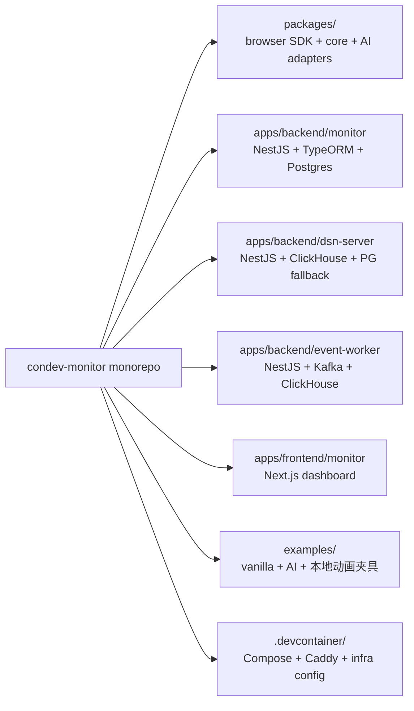
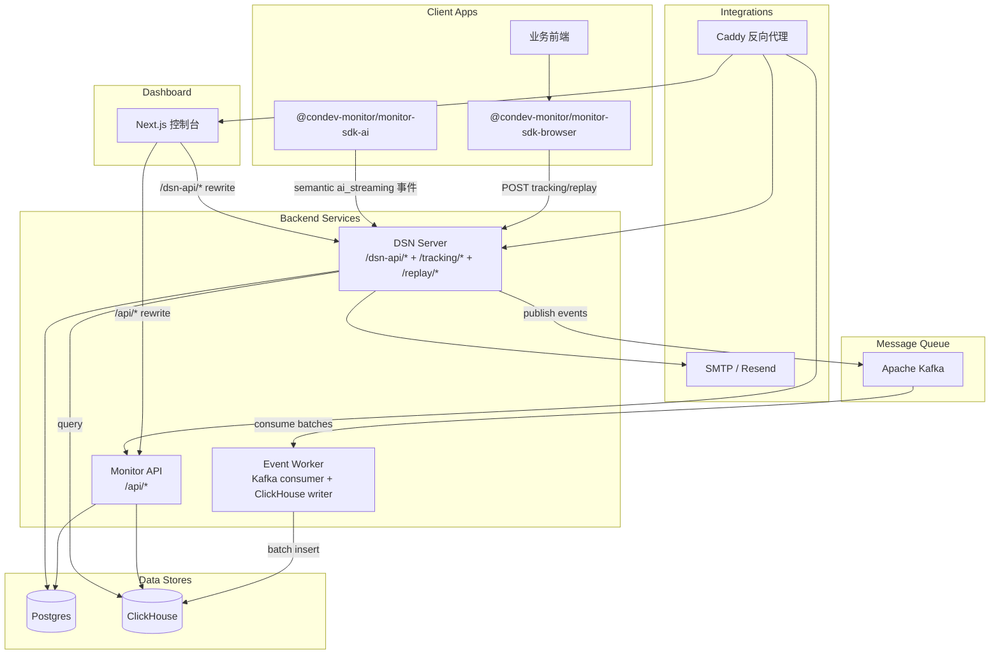
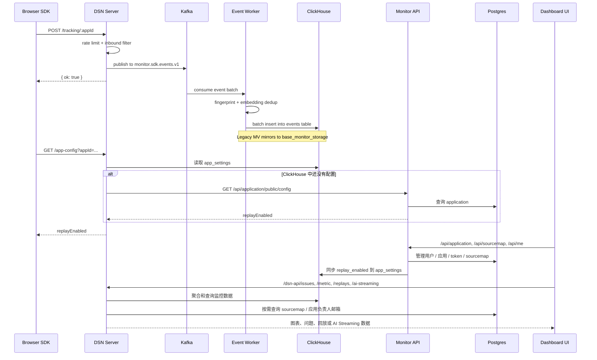

[English](./README.md) | 中文

# Condev Monitor

Condev Monitor 是一个可自托管的前端监控平台，采用 `pnpm` monorepo 组织。它包含：

- 浏览器 SDK：错误、性能、白屏、回放、AI Streaming 采集
- 基于 ClickHouse 的 DSN 摄取与查询服务
- 基于 Postgres 的监控管理 API
- 基于 Next.js 的控制台，用于应用、问题、指标、回放和 AI Streaming 追踪查看

## 目录

- [功能概览](#功能概览)
- [项目架构](#项目架构)
- [技术栈](#技术栈)
- [项目结构](#项目结构)
- [本地开发](#本地开发)
- [环境变量](#环境变量)
- [SDK 接入](#sdk-接入)
- [API 概览](#api-概览)
- [扩展文档](#扩展文档)
- [SDK 发包](#sdk-发包)
- [许可证](#许可证)

---

## 功能概览

**浏览器监控**

- JavaScript 运行时错误、资源加载错误、未处理 Promise Rejection
- Web Vitals 与运行时性能信号：`longTask`、`jank`、`lowFps`
- 白屏检测：启动阶段轮询 + 可选 Mutation 运行时观察
- 自定义消息与自定义事件上报 API
- 基于 `rrweb` 的错误触发最小会话回放
- 支持批量发送、错误立即 flush、失败重试与离线缓存

**应用与 Sourcemap**

- 应用管理与每个应用的 Replay 开关
- 按 `appId + release + dist + minifiedUrl` 进行 sourcemap 上传和查找
- Sourcemap Token 创建、撤销，适合 CI/CD 上传
- 在错误详情接口里做 sourcemap 反解和代码片段定位

**控制台**

- 应用总览页
- Bugs 聚合与近期错误事件查看
- Metric 图表与分位值汇总
- Replay 列表与播放页
- AI Streaming 面板：TTFB、TTLB、stall、token 使用、model/provider 等

**AI 驱动的 Issue 聚合**

- 基于嵌入向量的自动错误指纹识别（all-MiniLM-L6-v2）
- TF-IDF + 余弦相似度混合去重，阈值可配
- 可选 LLM 生成 Issue 标题（兼容 OpenAI 接口，每日定时执行）
- LLM 辅助确认相似 orphan issue 合并（每小时定时执行）
- Issue 生命周期：open、resolved、ignored、merged（Schema 层定义；worker 写入 open/merged，其余状态预留给未来前端/API）

**运维能力**

- 错误告警邮件聚合发送，单应用 5 分钟节流
- 自托管 Docker Compose 部署：ClickHouse、Postgres、Kafka、Caddy、三个后端和前端整套启动
- DSN 摄取路径支持每应用限流和入站过滤
- 可选的 OpenNext + Cloudflare 前端单独部署

---

## 项目架构

### 仓库拓扑


```mermaid
graph LR
    ROOT[condev-monitor monorepo]
    ROOT --> SDK[packages/<br/>browser SDK + core + AI adapters]
    ROOT --> BE1[apps/backend/monitor<br/>NestJS + TypeORM + Postgres]
    ROOT --> BE2[apps/backend/dsn-server<br/>NestJS + ClickHouse + PG fallback]
    ROOT --> BE3[apps/backend/event-worker<br/>NestJS + Kafka + ClickHouse]
    ROOT --> FE[apps/frontend/monitor<br/>Next.js dashboard]
    ROOT --> EX[examples/<br/>vanilla + AI + 本地动画夹具]
    ROOT --> OPS[.devcontainer/<br/>Compose + Caddy + infra config]
```

### 运行时高层数据流


```mermaid
graph TB
    subgraph Client Apps
        APP[业务前端]
        SDK["@condev-monitor/monitor-sdk-browser"]
        AI["@condev-monitor/monitor-sdk-ai"]
    end

    subgraph Dashboard
        FE[Next.js 控制台]
    end

    subgraph Backend Services
        MON[Monitor API<br/>/api/*]
        DSN[DSN Server<br/>/dsn-api/* + /tracking/* + /replay/*]
        WORKER[Event Worker<br/>Kafka consumer + ClickHouse writer]
    end

    subgraph Message Queue
        KAFKA[Apache Kafka]
    end

    subgraph Data Stores
        PG[(Postgres)]
        CH[(ClickHouse)]
    end

    subgraph Integrations
        MAIL[SMTP / Resend]
        CADDY[Caddy 反向代理]
    end

    APP --> SDK
    SDK -->|POST tracking/replay| DSN
    AI -->|semantic ai_streaming 事件| DSN
    DSN -->|publish events| KAFKA
    KAFKA -->|consume batches| WORKER
    WORKER -->|batch insert| CH
    FE -->|/api/* rewrite| MON
    FE -->|/dsn-api/* rewrite| DSN
    MON --> PG
    MON --> CH
    DSN -->|query| CH
    DSN --> PG
    DSN --> MAIL
    CADDY --> FE
    CADDY --> MON
    CADDY --> DSN
```

### 请求与数据流


```mermaid
sequenceDiagram
    participant B as Browser SDK
    participant D as DSN Server
    participant K as Kafka
    participant W as Event Worker
    participant C as ClickHouse
    participant M as Monitor API
    participant P as Postgres
    participant U as Dashboard UI

    B->>D: POST /tracking/:appId
    D->>D: rate limit + inbound filter
    D->>K: publish to monitor.sdk.events.v1
    D-->>B: { ok: true }
    K->>W: consume event batch
    W->>W: fingerprint + embedding dedup
    W->>C: batch insert into events table
    Note over W,C: Legacy MV mirrors to base_monitor_storage

    B->>D: GET /app-config?appId=...
    D->>C: 读取 app_settings
    alt ClickHouse 中还没有配置
        D->>M: GET /api/application/public/config
        M->>P: 查询 application
        M-->>D: replayEnabled
    end
    D-->>B: replayEnabled

    U->>M: /api/application, /api/sourcemap, /api/me
    M->>P: 管理用户 / 应用 / token / sourcemap
    M->>C: 同步 replay_enabled 到 app_settings

    U->>D: /dsn-api/issues, /metric, /replays, /ai-streaming
    D->>C: 聚合和查询监控数据
    D->>P: 按需查询 sourcemap / 应用负责人邮箱
    D-->>U: 图表、问题、回放或 AI Streaming 数据
```

### 从代码确认出的架构细节

- 默认部署摄取路径：SDK -> DSN Server -> Kafka -> Event Worker -> ClickHouse。在 DSN server 设置 `INGEST_MODE=direct` 可跳过 Kafka 直接写入 ClickHouse（适用于本地开发或兜底场景）。
- 控制台不会直接把浏览器请求打到后端宿主机端口，而是通过 Next.js rewrites：
    - `/api/*` -> `API_PROXY_TARGET` -> monitor backend
    - `/dsn-api/*` -> `DSN_API_PROXY_TARGET` -> dsn-server
- 浏览器 Replay 是否开启是按应用控制的。SDK 会先调用 `GET /app-config?appId=...` 再决定是否录制回放。
- Monitor backend 会把 Replay 开关同步到所配置 ClickHouse 数据库的 `app_settings` 表；DSN server 先查 ClickHouse，查不到再回源 monitor API。
- DSN server 对每个应用实施令牌桶限流。超限后返回 `429` 和 `Retry-After` / `X-Rate-Limit-Reset` 响应头。
- DSN server 的入站过滤会根据 payload 大小（`INBOUND_MAX_PAYLOAD_BYTES`）、user-agent 黑名单和 release 黑名单拒绝事件。
- 在配置的数据库（默认 `lemonade`）中，DSN ClickHouse schema 会创建：
    - `base_monitor_storage`（旧主表，保留兼容）
    - `events`（新主表，ReplacingMergeTree）
    - `events_to_legacy_mv`（兼容物化视图）
    - `base_monitor_view`
    - `app_settings`
    - `issues`（语义 Issue 分组）
    - `issue_embeddings`（去重用嵌入向量）
    - `cron_locks`（定时任务分布式锁）
- 非 Replay 事件默认 90 天 TTL；Replay 事件默认 30 天 TTL。Animation RUM v2 聚合表另按 `captured_at` 保留 90 天。Postgres 终态回执默认在首次接收 180 天后才有资格异步清理；隔离 Outbox 中的规范信封默认在隔离 7 天后有资格清理；Retention 不会删除 pending Outbox。
- Animation RUM v2 Retention 是最终清理机制，不是精确删除 SLA。一个副本会在启动时及之后按间隔执行有界清理，跳过正在加锁的应用，先删除 target 回执再删除 page 回执，并保留仍有 Outbox 或子回执依赖的回执。
- 前端鉴权通过 `app/auth-session/*` 路由把 monitor backend 的 JWT 放进 HTTP-only cookie `session_token`。

---

## 技术栈

| 层级            | 技术                                                        |
| --------------- | ----------------------------------------------------------- |
| Runtime         | Node.js 22                                                  |
| 包管理 / 构建   | pnpm 10 + Turbo                                             |
| 控制台          | Next.js 15、React 19、React Query、Tailwind CSS 4、Radix UI |
| Monitor backend | NestJS 11、TypeORM、Passport JWT、Postgres                  |
| DSN backend     | NestJS 11、ClickHouse、`pg` 连接池、Handlebars 邮件模板     |
| 事件处理        | NestJS 11、KafkaJS、ClickHouse、HuggingFace Transformers    |
| Browser SDK     | TypeScript、`tsup`、`rrweb`、自定义 transport / 离线队列    |
| AI tracing      | 面向 Vercel AI SDK 的 OpenTelemetry Span Processor 适配     |
| 消息队列        | Apache Kafka 3.9.2（KRaft 模式，无 ZooKeeper）              |
| 基础设施        | Docker、Docker Compose、Caddy、可选 OpenNext Cloudflare     |

说明：`apps/backend/monitor` 当前实际运行路径是 TypeORM，不是 Prisma。仓库中虽然有 Prisma 相关文件，但不是当前 Nest 启动链路的一部分。

---

## 项目结构

```text
condev-monitor/
├── apps/
│   ├── backend/
│   │   ├── monitor/                # 认证、用户、应用、sourcemap、Replay 开关同步
│   │   ├── dsn-server/             # DSN 摄取、ClickHouse 查询、告警、回放读取
│   │   └── event-worker/           # Kafka 消费、ClickHouse 批量写入、Issue 去重
│   └── frontend/
│       └── monitor/                # Next.js 控制台 + rrweb player
├── packages/
│   ├── core/                       # 监控核心能力与 capture API
│   ├── browser/                    # 浏览器 SDK
│   ├── browser-utils/              # Metrics / Web Vitals 工具
│   ├── animation/                  # 框架无关的动画采集、建议、overlay 与可选 RUM
│   ├── ai/                         # AI 语义监控适配层
│   ├── react/                      # React 集成（ErrorBoundary、useMonitorUser）
│   └── nextjs/                     # Next.js 集成（registerCondevClient/Server，RSC 安全再导出）
├── examples/
│   ├── vanilla/                    # Vite 示例，包含浏览器 SDK 和 sourcemap 脚本
│   ├── aisdk-rag-chatbox/          # Next.js 示例，包含浏览器端 + AI SDK tracing
│   └── animation-fixtures/         # 三个选定的本地项目；每个项目只有一次 Browser 动画初始化
├── .devcontainer/
│   ├── docker-compose.yml          # 本地基础设施：ClickHouse + Postgres + Kafka
│   ├── docker-compose.deply.yml    # 根脚本实际使用的整栈部署文件
│   ├── caddy/                      # 反向代理配置
│   └── clickhouse/                 # ClickHouse 初始化 SQL 与配置
├── scripts/
│   ├── init-clickhouse.sh          # 在部署 compose 里初始化 ClickHouse schema
│   └── init-kafka-topics.sh        # 在部署 compose 里创建 Kafka topic
├── CONTRIBUTING.md
├── DEPLOYMENT.md
├── README.md
└── README.zh-CN.md
```

### 工作区说明

- `pnpm-workspace.yaml` 纳入了 `packages/*`、`apps/frontend/*`、`apps/backend/*`、`examples/*` 和 `examples/animation-fixtures/*`
- `pnpm start:dev` 通过 Turbo 同时启动控制台、两个后端服务和事件处理 worker
- `pnpm start:fro` 只启动控制台
- 前端包名是 `@condev-monitor/monitor-client`
- 后端包名分别是 `monitor`、`dsn-server` 和 `event-worker`

---

## 本地开发

### 前置要求

- 推荐 Node.js `22.15+`
- pnpm `10.10.0`
- Docker + Docker Compose

### 1. 安装依赖

```bash
pnpm install
```

### 2. 准备本地环境变量

```bash
cp apps/backend/monitor/.env.example apps/backend/monitor/.env
cp apps/backend/dsn-server/.env.example apps/backend/dsn-server/.env
```

如果你还想本地验证整栈部署：

```bash
cp .devcontainer/.env.example .devcontainer/.env
```

### 3. 先启动基础设施

```bash
pnpm docker:start
```

这一步会一次性启动并初始化：

- `.devcontainer/docker-compose.yml` 里的 Postgres
- `.devcontainer/docker-compose.yml` 里的 ClickHouse + `.devcontainer/clickhouse/init/` 里的初始化 schema
- `.devcontainer/docker-compose.yml` 里的 Kafka + `scripts/init-kafka-topics.sh` 创建 topic

注意：`pnpm docker:start` 会自动执行 `docker:init-kafka` 和 `docker:init-clickhouse`。只有在需要恢复或幂等重新初始化时才需要单独运行这些脚本。

### 4. 启动完整应用的开发模式

```bash
pnpm start:dev
```

启动后可访问：

- `apps/frontend/monitor` -> `http://localhost:3000`
- `apps/backend/monitor` -> `http://localhost:8081/api/*`
- `apps/backend/dsn-server` -> `http://localhost:8082/dsn-api/*`
- `apps/backend/event-worker`（Kafka 消费者，写入 ClickHouse）

如果 3000 端口已被占用，可以使用任务专用的 shell 变量，不需要修改任何 `.env` 文件：

```bash
CONDEV_MONITOR_FRONTEND_PORT=3001 pnpm start:dev
```

### 5. 仅启动控制台

```bash
pnpm start:fro
```

这个命令只启动 `http://localhost:3000` 上的控制台；上面的完整 `pnpm start:dev` 已经包含控制台。

默认代理关系：

- `/api/*` -> `http://localhost:8081`
- `/dsn-api/*` -> `http://localhost:8082`

如果你的后端不是这个地址，可以这样启动：

```bash
API_PROXY_TARGET=http://127.0.0.1:8081 \
DSN_API_PROXY_TARGET=http://127.0.0.1:8082 \
pnpm start:fro
```

### 本地常用地址

| 服务             | 地址                                    |
| ---------------- | --------------------------------------- |
| 控制台           | `http://localhost:3000`                 |
| Monitor API      | `http://localhost:8081/api`             |
| DSN Server       | `http://localhost:8082/dsn-api`         |
| DSN 健康检查     | `http://localhost:8082/dsn-api/healthz` |
| ClickHouse HTTP  | `http://localhost:8123`                 |
| Postgres         | `localhost:5432`                        |
| Kafka (external) | `localhost:9094`                        |

### 运行示例工程

```bash
pnpm --filter vanilla dev
pnpm --filter aisdk-rag-chatbox dev
```

`examples/vanilla` 是验证 SDK 行为最快的方式，覆盖错误、白屏、性能、Replay、transport 批量发送和 sourcemap 上传。

---

## 环境变量

### Env 文件位置

- 本地 monitor backend：`apps/backend/monitor/.env`
- 本地 dsn-server backend：`apps/backend/dsn-server/.env`
- 整栈 Docker 部署：`.devcontainer/.env`
- 前端本地代理变量：运行 `pnpm start:fro` 前在 shell 里注入
- 整栈开发时的控制台端口：运行 `pnpm start:dev` 前在 shell 里设置 `CONDEV_MONITOR_FRONTEND_PORT`（默认 `3000`）

两个后端的代码都会显式按顺序查找 env：

1. `apps/backend/<service>/.env`
2. package 根目录 `.env`
3. `dist` 附近的 fallback `.env`

### Monitor API（`apps/backend/monitor/.env`）

| 变量                                                                                                                        | 作用                                                               |
| --------------------------------------------------------------------------------------------------------------------------- | ------------------------------------------------------------------ |
| `DB_TYPE`, `DB_HOST`, `DB_PORT`, `DB_USERNAME`, `DB_PASSWORD`, `DB_DATABASE`                                                | Postgres 连接，用于用户、应用、sourcemap、token 等管理数据         |
| `DB_AUTOLOAD`, `DB_SYNC`                                                                                                    | TypeORM 行为控制。生产环境建议 `DB_SYNC=false`                     |
| `JWT_SECRET`                                                                                                                | 登录鉴权、重置密码、邮箱验证、修改邮箱 token 都依赖它              |
| `CORS`                                                                                                                      | 为 `true` 时开启 Nest CORS                                         |
| `CLICKHOUSE_URL`, `CLICKHOUSE_USERNAME`, `CLICKHOUSE_PASSWORD`, `CLICKHOUSE_DATABASE`                                       | ClickHouse 必填连接配置和各服务共用的数据库名                      |
| `MAIL_ON`                                                                                                                   | Monitor 邮件总开关                                                 |
| `RESEND_API_KEY`, `RESEND_FROM`                                                                                             | `MAIL_ON=true` 时启用 Resend 模式                                  |
| `EMAIL_SENDER`, `EMAIL_SENDER_PASSWORD`                                                                                     | `MAIL_ON=true` 且未配置 Resend 时启用 SMTP                         |
| `SMTP_HOST`, `SMTP_PORT`, `SMTP_SECURE`, `SMTP_CONNECTION_TIMEOUT_MS`, `SMTP_GREETING_TIMEOUT_MS`, `SMTP_SOCKET_TIMEOUT_MS` | SMTP 高级配置                                                      |
| `AUTH_REQUIRE_EMAIL_VERIFICATION`                                                                                           | 可选覆盖项。不传时，如果 SMTP 或 Resend 可用，则默认要求邮箱验证   |
| `FRONTEND_URL`                                                                                                              | 生成邮箱验证、重置密码、改邮箱确认链接时使用                       |
| `SOURCEMAP_STORAGE_DIR`                                                                                                     | Sourcemap 文件落盘目录。不传时默认使用包目录下的 `data/sourcemaps` |
| `ERROR_FILTER`                                                                                                              | 设置后启用全局异常过滤器                                           |

重要说明：`apps/backend/monitor/src/main.ts` 当前把 monitor API 端口写死为 `8081`。虽然代码里保留了 `PORT` 的注释逻辑，但现在没有真正生效。

### DSN Server（`apps/backend/dsn-server/.env`）

| 变量                                                                                                                    | 作用                                                                                                          |
| ----------------------------------------------------------------------------------------------------------------------- | ------------------------------------------------------------------------------------------------------------- |
| `PORT`                                                                                                                  | DSN server 监听端口，默认 `8082`                                                                              |
| `DSN_BODY_LIMIT`                                                                                                        | Express JSON / URL encoded / text body 限制。Replay 包大时要调大                                              |
| `CLICKHOUSE_URL`, `CLICKHOUSE_USERNAME`, `CLICKHOUSE_PASSWORD`, `CLICKHOUSE_DATABASE`                                   | 必填。负责写入、查询监控数据并统一数据库名                                                                    |
| `DB_HOST`, `DB_PORT`, `DB_USERNAME`, `DB_PASSWORD`, `DB_DATABASE`                                                       | Postgres 查负责人邮箱与 sourcemap 元数据                                                                      |
| `MONITOR_API_URL`                                                                                                       | ClickHouse 里没有 Replay 配置时，回源调用 `GET /api/application/public/config`                                |
| `ALERT_EMAIL_FALLBACK`                                                                                                  | 找不到应用负责人邮箱时的兜底收件人                                                                            |
| `APP_OWNER_EMAIL_CACHE_TTL_MS`                                                                                          | `appId -> owner email` 缓存 TTL                                                                               |
| `SOURCEMAP_CACHE_MAX`, `SOURCEMAP_CACHE_TTL_MS`                                                                         | Sourcemap 内存缓存大小和 TTL                                                                                  |
| `RESEND_API_KEY`, `RESEND_FROM`                                                                                         | 告警邮件使用 Resend                                                                                           |
| `EMAIL_SENDER`, `EMAIL_SENDER_PASSWORD`                                                                                 | 告警邮件使用 SMTP                                                                                             |
| `EMAIL_PASS`, `EMAIL_PASSWORD`                                                                                          | dsn-server 邮件模块兼容读取的旧变量名                                                                         |
| `INGEST_MODE`                                                                                                           | `kafka`（部署默认）或 `direct`；Animation RUM v2 会通过所选传输排空持久化 Postgres Outbox                     |
| `KAFKA_ENABLED`                                                                                                         | Kafka 生产者总开关；为 `false` 时，即使 `INGEST_MODE=kafka`，Animation RUM v2 Outbox 也会改由 ClickHouse 排空 |
| `ANIMATION_RUM_V2_OUTBOX_ENABLED`                                                                                       | 仅在需要暂停排空 Animation RUM v2 Outbox 时设为 `false`；Postgres 仍会持久接收数据                            |
| `ANIMATION_RUM_V2_OUTBOX_POLL_MS`, `ANIMATION_RUM_V2_OUTBOX_CONCURRENCY`, `ANIMATION_RUM_V2_OUTBOX_LEASE_MS`            | Outbox 调度默认值：`1000` ms、`2` 个 worker、`60000` ms 租约                                                  |
| `ANIMATION_RUM_V2_OUTBOX_RETRY_BASE_MS`, `ANIMATION_RUM_V2_OUTBOX_RETRY_MAX_MS`, `ANIMATION_RUM_V2_OUTBOX_MAX_ATTEMPTS` | 持久重试默认值：`1000` ms 指数退避起点、`300000` ms 上限、隔离前最多 `288` 次                                 |
| `ANIMATION_RUM_V2_RECEIPT_RETENTION_DAYS`                                                                               | 新接收回执写入时固化的保留期，默认 `180`；必须是 `120`–`365` 的整数，否则启动失败                             |
| `ANIMATION_RUM_V2_RETENTION_ENABLED`, `ANIMATION_RUM_V2_RETENTION_INTERVAL_MS`                                          | Retention worker 开关与间隔，默认 `true`、`3600000` ms；间隔范围 `60000`–`86400000`                           |
| `ANIMATION_RUM_V2_QUARANTINE_ENVELOPE_RETENTION_DAYS`                                                                   | 隔离规范信封进入可清理状态前的天数，默认 `7`；范围 `1`–`30`                                                   |
| `ANIMATION_RUM_V2_RETENTION_APP_LIMIT`, `ANIMATION_RUM_V2_RETENTION_BATCH_SIZE`                                         | 每轮应用数与每应用行数上限，默认 `25`、`100`；范围 `1`–`100`、`10`–`500`                                      |
| `ANIMATION_RUM_V2_RETENTION_MAX_ROWS_PER_CYCLE`, `ANIMATION_RUM_V2_RETENTION_MAX_CYCLE_MS`                              | 每轮全局行数/时间上限，默认 `1000` 行、`10000` ms；范围 `100`–`5000`、`1000`–`60000`                          |
| `KAFKA_BROKERS`                                                                                                         | Kafka broker 地址，逗号分隔                                                                                   |
| `KAFKA_CLIENT_ID`                                                                                                       | Kafka 生产者 client 标识                                                                                      |
| `KAFKA_EVENTS_TOPIC`                                                                                                    | SDK 事件 topic，默认 `monitor.sdk.events.v1`                                                                  |
| `KAFKA_REPLAYS_TOPIC`                                                                                                   | Replay 上传 topic，默认 `monitor.sdk.replays.v1`                                                              |
| `KAFKA_FALLBACK_TO_CLICKHOUSE`                                                                                          | 旧协议/非 v2 的回退开关；RUM v2 会持续重试持久化 Outbox，不会在单条消息中途切换传输                           |
| `INBOUND_MAX_PAYLOAD_BYTES`                                                                                             | 每个请求允许的最大 payload 大小（反序列化前）                                                                 |
| `INBOUND_UA_BLACKLIST`                                                                                                  | 需拒绝的 user-agent 子串，逗号分隔                                                                            |
| `INBOUND_RELEASE_BLACKLIST`                                                                                             | 需拒绝的 release 标识，逗号分隔                                                                               |
| `RATE_LIMIT_EVENTS_PER_SEC`                                                                                             | 每应用令牌桶补充速率（事件/秒）                                                                               |
| `RATE_LIMIT_BURST`                                                                                                      | 每应用令牌桶突发容量                                                                                          |
| `RATE_LIMIT_MAX_APPS`                                                                                                   | 限流追踪的最大应用数                                                                                          |

### 前端 / Rewrite 相关变量

控制台没有单独提交 `.env.example`，当前最主要的运行时变量是：

| 变量                      | 作用                                                          |
| ------------------------- | ------------------------------------------------------------- |
| `API_PROXY_TARGET`        | `/api/*` rewrite 的目标地址，默认 `http://localhost:8081`     |
| `DSN_API_PROXY_TARGET`    | `/dsn-api/*` rewrite 的目标地址，默认 `http://localhost:8082` |
| `NEXT_TELEMETRY_DISABLED` | 容器或 CI 构建时建议开启                                      |

### Event Worker（`apps/backend/event-worker/.env`）

| 变量                             | 作用                                                       |
| -------------------------------- | ---------------------------------------------------------- |
| `CLICKHOUSE_URL`                 | ClickHouse HTTP 端点，用于批量写入                         |
| `CLICKHOUSE_USERNAME`            | ClickHouse 用户名                                          |
| `CLICKHOUSE_PASSWORD`            | ClickHouse 密码                                            |
| `CLICKHOUSE_DATABASE`            | 各服务共用的 ClickHouse 数据库名，默认 `lemonade`          |
| `KAFKA_BROKERS`                  | Kafka broker 地址，逗号分隔                                |
| `KAFKA_CLIENT_ID`                | Kafka 消费者 client 标识                                   |
| `KAFKA_CONSUMER_GROUP`           | 消费组 ID，默认 `monitor-clickhouse-writer-v1`             |
| `KAFKA_EVENTS_TOPIC`             | 消费的事件 topic，默认 `monitor.sdk.events.v1`             |
| `KAFKA_REPLAYS_TOPIC`            | 消费的 Replay topic，默认 `monitor.sdk.replays.v1`         |
| `KAFKA_DLQ_TOPIC`                | 死信队列 topic，默认 `monitor.sdk.dlq.v1`                  |
| `EVENT_BATCH_SIZE`               | 每次 ClickHouse 批量写入的最大事件数                       |
| `EVENT_BATCH_MAX_WAIT_MS`        | 批量未满时的最长等待时间                                   |
| `EMBEDDING_MODEL_ID`             | HuggingFace Issue 嵌入模型，默认 `Xenova/all-MiniLM-L6-v2` |
| `ISSUE_EMBEDDING_HIGH_THRESHOLD` | 余弦相似度高于此值自动合并 Issue，默认 `0.92`              |
| `ISSUE_EMBEDDING_LOW_THRESHOLD`  | 余弦相似度高于此值触发 TF-IDF 二次确认，默认 `0.85`        |
| `ISSUE_TFIDF_THRESHOLD`          | TF-IDF 相似度确认阈值，默认 `0.80`                         |
| `LLM_PROVIDER`                   | LLM 提供者类型，默认 `openai-compatible`                   |
| `LLM_BASE_URL`                   | LLM API 基础地址                                           |
| `LLM_API_KEY`                    | LLM API 密钥                                               |
| `LLM_MODEL`                      | LLM 模型标识，默认 `gpt-4o-mini`                           |
| `LLM_MAX_TOKENS`                 | LLM 最大输出 token 数，默认 `1024`                         |
| `LLM_TEMPERATURE`                | LLM 采样温度，默认 `0.1`                                   |

### Compose / 基础设施变量（`.devcontainer/.env`）

| 变量                                                                                                                            | 作用                                                          |
| ------------------------------------------------------------------------------------------------------------------------------- | ------------------------------------------------------------- |
| `POSTGRES_PORT`                                                                                                                 | 本地基础设施 compose 的 Postgres 宿主机端口                   |
| `CLICKHOUSE_HTTP_PORT`, `CLICKHOUSE_NATIVE_PORT`                                                                                | ClickHouse 宿主机端口                                         |
| `CLICKHOUSE_USERNAME`, `CLICKHOUSE_PASSWORD`, `CLICKHOUSE_DATABASE`                                                             | ClickHouse 初始化用户名、密码和规范库名                       |
| `CLICKHOUSE_MAX_HTTP_BODY_SIZE`                                                                                                 | ClickHouse HTTP 写入上限                                      |
| `KAFKA_EXTERNAL_PORT`                                                                                                           | Kafka 外部监听宿主机端口，默认 `9094`                         |
| `KAFKA_BROKERS`                                                                                                                 | DSN server 和 event worker 使用的 broker 地址                 |
| `KAFKA_CONSUMER_GROUP`                                                                                                          | Event worker 消费组，默认 `monitor-clickhouse-writer-v1`      |
| `INGEST_MODE`                                                                                                                   | `kafka` 或 `direct`，控制 DSN server 摄取管道                 |
| `CADDY_HTTP_HOST_PORT`, `CADDY_HTTP_CONTAINER_PORT`, `CADDY_HTTPS_HOST_PORT`                                                    | Caddy 对外端口映射                                            |
| `CADDY_DSN_MAX_BODY_SIZE`                                                                                                       | `/dsn-api/*`、`/tracking/*`、`/replay/*` 的反向代理 body 限制 |
| `MAIL_ON`, `AUTH_REQUIRE_EMAIL_VERIFICATION`, `FRONTEND_URL`, `DSN_BODY_LIMIT`, `SOURCEMAP_CACHE_MAX`, `SOURCEMAP_CACHE_TTL_MS` | 整栈部署时传入容器的共享业务配置                              |
| `EMBEDDING_MODEL_ID`, `ISSUE_EMBEDDING_HIGH_THRESHOLD`, `ISSUE_EMBEDDING_LOW_THRESHOLD`, `ISSUE_TFIDF_THRESHOLD`                | Event worker Issue 去重调参                                   |
| `LLM_PROVIDER`, `LLM_BASE_URL`, `LLM_API_KEY`, `LLM_MODEL`, `LLM_MAX_TOKENS`, `LLM_TEMPERATURE`                                 | Event worker LLM 集成                                         |

`CLICKHOUSE_DATABASE` 默认仍为 `lemonade`，由 ClickHouse 初始化、schema 重放、Monitor、DSN 与 Event Worker 共用；旧 `CLICKHOUSE_DB` 继续作为兼容回退。库名只能包含 ASCII 字母、数字和下划线，且不能以数字开头。

### 邮件模式选择逻辑

当前代码里的邮件模式选择顺序是：

1. `MAIL_ON=false` -> 实际关闭
2. `MAIL_ON=true` 且设置 `RESEND_API_KEY` -> Resend
3. `MAIL_ON=true` 且设置 `EMAIL_SENDER` + `EMAIL_SENDER_PASSWORD` -> SMTP
4. `MAIL_ON=true` 但没有提供可用凭证 -> JSON transport / 仅打印 warning，不真实投递

---

## SDK 接入

这个仓库现在支持两种接入方式：

- 按下方文档手动插入 SDK
- 通过仓库内置的 Codex skill 自动化接入：[`.codex/skills/condev-sdk-integration/SKILL.md`](.codex/skills/condev-sdk-integration/SKILL.md)

### Skill 接入

如果你使用 Codex 给现有 AI 应用接入 Condev，可以直接让它遵循仓库里的 skill，而不是手动逐个文件插入 SDK。

Skill 入口：

- [`.codex/skills/condev-sdk-integration/SKILL.md`](.codex/skills/condev-sdk-integration/SKILL.md)

当前支持的项目形态：

- Next.js App Router + Vercel AI SDK
- React/Vite 前端 + 独立 FastAPI 风格 RAG 后端

这个 skill 沉淀的是和示例项目一致的接入流程，同时尽量不改动业务逻辑。它会指导 Codex：

- 先补 DSN env 变量
- 接入浏览器端 SDK bootstrap
- 加上 session 和 user 透传
- 如果应用有独立 AI 后端，再补后端语义 trace
- 验证 `AI Streaming`、`AI Traces`、`AI Sessions`、`AI Users`、`AI Cost`

skill 使用的规范示例：

- [`examples/aisdk-rag-chatbox`](examples/aisdk-rag-chatbox)
- [`examples/rag`](examples/rag)

示例提示词：

- `Use the condev-sdk-integration skill to instrument this Next.js + Vercel AI SDK app.`
- `Use the condev-sdk-integration skill to add Condev monitoring to this React/Vite frontend and FastAPI RAG backend.`

### Next.js 快速开始

对于 Next.js 项目，推荐使用 `@condev-monitor/nextjs`，它将浏览器 SDK 和 AI 监控统一封装为简洁的接入 API。

**`instrumentation-client.ts`**（客户端，hydration 前执行）：

```ts
import { registerCondevClient } from '@condev-monitor/nextjs/client'

registerCondevClient({
    // dsn 默认读取 process.env.NEXT_PUBLIC_CONDEV_DSN
    replay: true,
    aiStreaming: { urlPatterns: ['/api/chat'] },
})
```

**`instrumentation.ts`**（服务端，Node.js 环境）：

```ts
export async function register() {
    if (process.env.NEXT_RUNTIME === 'nodejs') {
        const { registerCondevServer } = await import('@condev-monitor/nextjs/server')
        await registerCondevServer({ debug: true })
        // dsn 默认读取 process.env.CONDEV_DSN ?? process.env.NEXT_PUBLIC_CONDEV_DSN
    }
}
```

`registerCondevServer` 会自动处理 OTel provider 注册——存在 `NodeTracerProvider` 时直接 `addSpanProcessor`，不存在时回退创建并注册 `BasicTracerProvider`。

**React 组件**（从主入口导入）：

```ts
import { CondevErrorBoundary, useMonitorUser } from '@condev-monitor/nextjs'

// 同步认证状态到监控 SDK
useMonitorUser(currentUser ?? null)

// 在组件树边界捕获错误
<CondevErrorBoundary fallback={<ErrorPage />}>
    <App />
</CondevErrorBoundary>
```

### React 集成（非 Next.js 项目）

```ts
import { init } from '@condev-monitor/react'
import { CondevErrorBoundary, useMonitorUser } from '@condev-monitor/react'

init({ dsn: 'https://monitor.example.com/tracking/<appId>' })
```

同一个客户端还需要 React 渲染证据时，使用独立的 animation 入口：

```tsx
import { CondevAnimationProfiler, init } from '@condev-monitor/react/animation'

const monitor = init({
    dsn: 'https://monitor.example.com/tracking/<appId>',
    performance: true,
    animation: { devtools: import.meta.env.DEV },
})

root.render(
    <CondevAnimationProfiler client={monitor}>
        <App />
    </CondevAnimationProfiler>
)
```

这里仍然只有一个 Browser client 和一次 `init()`。animation 入口也会继续导出 React 包原有的 ErrorBoundary 和用户 hooks，因此混合使用时不需要拆成两个包入口。该包装器使用 React 官方 `Profiler`，只记录匿名子树渲染时长，不保留 Profiler id、组件名、props 或 state；也不会把 React 的 `commitTime` 冒充 commit 耗时：它只是传入 adapter 的时间戳，最终有界记录使用 SDK 自己的单调采集时钟。标准 React 生产构建默认关闭 Profiler 回调，因此只有在明确授权并衡量额外开销后，才应使用启用 profiling 的 React 构建采集生产框架证据；不使用该包装器也不影响页面级动效采集。

### Vue 集成

```ts
import { init, useCondevAnimation } from '@condev-monitor/vue/animation'
import { ref } from 'vue'

const monitor = init({
    dsn: 'https://monitor.example.com/tracking/<appId>',
    performance: true,
    animation: { devtools: import.meta.env.DEV },
})

const host = ref<HTMLElement | null>(null)
useCondevAnimation({ client: monitor, getTarget: () => host.value })
```

这个 composable 必须在 `setup()` 中同步调用。它只使用 Vue 官方 `onBeforeUpdate` 与 `onUpdated` 生命周期，并把两者之间的耗时作为**更新窗口**写入同一个 Browser client。这个窗口可能包含组件及同步后代更新、DOM patch，以及落在两个回调之间的生命周期工作，因此 Condev 不会把它标成 Vue render、commit、paint 或 GPU 时间。可选的真实元素身份与原始 owner 证据只留在页面内存；如果应用另外把该元素授权为语义化 RUM v2 target，只会投影闭集 `vue` framework 与 `framework-adapter` capability，不保留或上传组件名、props、state、文字、selector、class、id 或 URL。不使用 composable 也不影响页面级动效采集。

### Angular 集成

```ts
import { ElementRef, inject, Injector } from '@angular/core'
import { createCondevAngularAnimationScope, init, registerCondevAngularPostRender } from '@condev-monitor/angular/animation'

const monitor = init({
    dsn: 'https://monitor.example.com/tracking/<appId>',
    performance: true,
    animation: { devtools: !import.meta.env.PROD },
})

export class AnimatedCard {
    private readonly injector = inject(Injector)
    private readonly host = inject<ElementRef<HTMLElement>>(ElementRef).nativeElement
    private readonly condev = createCondevAngularAnimationScope({ client: monitor, getTarget: () => this.host })
    private readonly postRender = registerCondevAngularPostRender(this.condev, { injector: this.injector })

    ngDoCheck(): void {
        this.condev.checkStarted()
    }

    ngAfterViewChecked(): void {
        this.condev.viewChecked()
    }

    ngOnDestroy(): void {
        this.postRender.destroy()
        this.condev.destroy()
    }
}
```

这里仍然只有一个 Browser client 和一次 `init()`。公开的 `ngDoCheck` 到 `ngAfterViewChecked` 区间只记为**组件检查窗口**：它可能包含后代检查，也不能证明发生了 DOM 变更。Angular 20+ 的应用级 `afterEveryRender({ read })` 只用于在页面 DOM 渲染后同步匿名 target 归属；它不与组件窗口拼接，也不产生耗时。两者都不会被标成 render、commit、DOM update、paint 或 GPU 时间。真实 Element 只留在本地；显式授权的语义化 RUM v2 target 最多只投影闭集 `angular` framework 与 `framework-adapter` capability，不会上传组件名、inputs、state、文字、selector、class、id 或 URL。

只需要低侵入 target 归属时，可以在应用自己的 standalone attribute directive 中调用 `bindCondevAngularAnimationTarget()`；完整配方见 `packages/angular/README.md`。helper 只增加匿名归属，并返回带状态的幂等可调用 handle，让不可用注册保持可见；当它与 scope 的 `getTarget` 使用同一个 client 和 Element 时，两者共享一个带引用计数的 Angular 注册。当前包还不会直接发布带装饰器的 directive，因为现有 `tsup` 产物不等于 Angular partial compilation/APF；包装迁移以及 Angular 20/21/22 真实 AOT consumer 矩阵仍是明确的后续任务。

### Svelte 集成

```svelte
<script lang="ts">
    import { condevAnimationTarget, init, useCondevAnimation } from '@condev-monitor/svelte/animation'

    const monitor = init({
        dsn: 'https://monitor.example.com/tracking/<appId>',
        performance: true,
        animation: { devtools: import.meta.env.DEV },
    })

    let count = $state(0)
    const condev = useCondevAnimation({ client: monitor })

    $effect.pre(() => condev.trackPendingStateWindow(count))
</script>

<button use:condevAnimationTarget={condev} onclick={() => count += 1}>{count}</button>
```

这里仍然只有一个 Browser client 和一次 `init()`。Svelte-aware 的 `/animation` 入口因为使用 Svelte 5 ESM runtime 而仅提供 ESM；不感知框架的 package root 仍保留 CommonJS 导出。runes 模式下，第一次 `$effect.pre` 只为 scope 预热；后续调用开始一个追踪依赖窗口，并在公开 `tick()` 确认 pending state changes 已应用后闭合。runes 模式没有公开的组件级统一 before/after update 生命周期，因此这个窗口不能证明当前组件或 target 确实修改了 DOM，也不会被标成 render、commit、paint 或 GPU 时间。需要触发观测的 state 或 derived value 都应作为参数传入。action 只把真实 Element 和匿名 owner 证据留在本地内存；显式授权的语义化 RUM v2 target 最多投影闭集 `svelte` framework 与 `framework-adapter` capability，不保留或上传依赖值、组件名、props、state、文字、selector、class、id 或 URL。本地有界 `getDiagnostics()` 计数会把 adapter 失败与空闲 scope 区分开，但不会上传这些诊断。

### Solid 集成

```tsx
import { createEffect } from 'solid-js'
import { condevAnimationTarget, init, useCondevAnimation } from '@condev-monitor/solid/animation'

const monitor = init({
    dsn: 'https://monitor.example.com/tracking/<appId>',
    performance: true,
    animation: { devtools: import.meta.env.DEV },
})

export function AnimatedCard() {
    const condev = useCondevAnimation({ client: monitor })

    createEffect(() =>
        condev.measureReactiveWork(() => {
            // 这里只放已有的同步 effect/computation 工作。
        })
    )

    return <div use:condevAnimationTarget={condev} />
}
```

这里仍然只有一个 Browser client 和一次 `init()`。`measureReactiveWork()` 只把调用方显式传入的同步 callback 记录为通用 host `script` self-time，并原样保留返回值或抛出的异常。支持范围内的 Solid（`>=1.9.10 <2`）没有公开的组件级 before/after commit 或 after-paint hook，effect 顺序也不是组件耗时边界，因此 Condev 不会把这个 self-time 冒充 Solid render、update、组件检查、commit、DOM、paint 或 GPU 工作。这个包不会自动新建 effect；只有当某段已有 callback 的自身耗时确实有意义时才包裹它。`condevAnimationTarget` directive 只把真实 Element 与匿名 owner 留在本地，并在元素 owner 销毁时立即注销，即使外层组件仍存活；显式授权的 RUM v2 target 最多投影闭集 `solid` framework 与 `framework-adapter` capability，不上传组件名、signal、props、state、文字、selector、class、id 或 URL。Solid 2 预发布版在公开生命周期合同重新验证前明确不支持。

### 浏览器 SDK 快速开始

```ts
import { init } from '@condev-monitor/monitor-sdk-browser'

const release = import.meta.env.VITE_MONITOR_RELEASE
const dist = import.meta.env.VITE_MONITOR_DIST

init({
    dsn: 'https://monitor.example.com/tracking/<appId>',
    release,
    dist,
    whiteScreen: { runtimeWatch: true },
    performance: true,
    replay: true,
    aiStreaming: false,
})
```

### 浏览器 SDK 关键参数

| 参数              | 说明                                                            |
| ----------------- | --------------------------------------------------------------- |
| `dsn`             | 必填。推荐格式：`https://<host>/<base>/tracking/<appId>`        |
| `release`, `dist` | sourcemap 反解所需                                              |
| `whiteScreen`     | 传 `false` 关闭；传对象可配置轮询和运行时 Mutation 观察         |
| `performance`     | 传 `false` 关闭；传对象可配置 `longTask`、`jank`、`lowFps` 阈值 |
| `replay`          | 传 `false` 关闭；传对象可配置回放缓冲窗口和上传行为             |
| `transport`       | 队列、重试、离线缓存、debug 日志                                |
| `aiStreaming`     | 默认关闭；开启后会采集浏览器侧流式请求网络指标                  |

### 手动触发白屏检查

```ts
import { triggerWhiteScreenCheck } from '@condev-monitor/monitor-sdk-browser'

triggerWhiteScreenCheck('route-change')
```

### 自定义上报 API

```ts
import { captureEvent, captureException, captureMessage } from '@condev-monitor/monitor-sdk-core'

captureMessage('hello')
captureEvent({ eventType: 'cta_click', data: { id: 'buy' } })
captureException(new Error('manual error'))
```

### 服务端 AI 语义监控

仓库提供了 `@condev-monitor/monitor-sdk-ai`。Next.js 项目推荐通过 `@condev-monitor/nextjs/server` 接入（见上方 [Next.js 快速开始](#nextjs-快速开始)）。

非 Next.js 的 Node.js 环境，可手动配置 OTel span processor：

```ts
import { BasicTracerProvider } from '@opentelemetry/sdk-trace-base'
import { trace } from '@opentelemetry/api'
import { initAIMonitor, VercelAIAdapter } from '@condev-monitor/monitor-sdk-ai'

const processor = initAIMonitor({
    dsn: process.env.CONDEV_DSN!,
    adapter: new VercelAIAdapter(),
    debug: true,
})

trace.setGlobalTracerProvider(
    new BasicTracerProvider({
        spanProcessors: [processor as any],
    })
)
```

这部分会发送语义层 `ai_streaming` 事件，dsn-server 再用 `traceId` 和浏览器侧网络层事件做 Join。

### Sourcemap 上传流程

推荐直接参考 `examples/vanilla/scripts`：

- `gen-release.sh`
- `build-with-sourcemaps.sh`
- `upload-sourcemaps.sh`

上传脚本支持这些变量：

| 变量                                                            | 作用                                               |
| --------------------------------------------------------------- | -------------------------------------------------- |
| `MONITOR_APP_ID` 或 `APP_ID`                                    | 目标应用 id                                        |
| `MONITOR_TOKEN`、`SOURCEMAP_TOKEN` 或 `MONITOR_SOURCEMAP_TOKEN` | Sourcemap 上传 token                               |
| `MONITOR_RELEASE` 或 `VITE_MONITOR_RELEASE`                     | Release 标识                                       |
| `MONITOR_DIST` 或 `VITE_MONITOR_DIST`                           | 可选的 dist 标识                                   |
| `MONITOR_PUBLIC_URL`                                            | 用来拼接 `minifiedUrl` 的公网 URL 前缀             |
| `MONITOR_API_URL`                                               | Monitor backend 地址，默认 `http://localhost:8081` |
| `MONITOR_DIST_DIR`                                              | 构建产物目录，默认 `dist`                          |

上传接口是：

```text
POST /api/sourcemap/upload
```

认证支持两种方式：

- `Authorization: Bearer <monitor-jwt>`
- `X-Sourcemap-Token: <token>`
- `X-Api-Token: <token>`

---

## API 概览

### Monitor API（`/api`）

| 接口                                           | 作用                            |
| ---------------------------------------------- | ------------------------------- |
| `POST /api/admin/register`                     | 注册控制台用户                  |
| `POST /api/auth/login`                         | 登录并签发 JWT                  |
| `POST /api/auth/logout`                        | 登出标记接口                    |
| `GET /api/currentUser` / `GET /api/me`         | 当前登录用户信息                |
| `POST /api/auth/forgot-password`               | 发送重置密码邮件                |
| `POST /api/auth/reset-password`                | 重置密码                        |
| `POST /api/auth/reset-password/verify`         | 校验重置 token                  |
| `POST /api/auth/verify-email`                  | 邮箱验证                        |
| `POST /api/auth/change-email/request`          | 发起修改邮箱确认                |
| `POST /api/auth/change-email/confirm`          | 确认修改邮箱                    |
| `GET /api/application`                         | 获取当前用户应用列表            |
| `POST /api/application`                        | 创建应用                        |
| `PUT /api/application`                         | 更新名称 / Replay 开关 / 元数据 |
| `DELETE /api/application`                      | 软删除应用                      |
| `GET /api/application/public/config?appId=...` | 公共 Replay 配置查询            |
| `GET /api/sourcemap?appId=...`                 | 获取 sourcemap 列表             |
| `POST /api/sourcemap/upload`                   | 上传 sourcemap                  |
| `GET /api/sourcemap/token?appId=...`           | 获取 sourcemap token 列表       |
| `POST /api/sourcemap/token`                    | 创建 sourcemap token            |
| `DELETE /api/sourcemap/token/:id`              | 撤销 sourcemap token            |
| `DELETE /api/sourcemap/:id`                    | 删除 sourcemap 记录             |

### DSN Server（`/dsn-api`）

| 接口                                                | 作用                                 |
| --------------------------------------------------- | ------------------------------------ |
| `GET /dsn-api/healthz`                              | 存活检查                             |
| `POST /dsn-api/tracking/:app_id`                    | 主事件摄取接口                       |
| `GET /dsn-api/app-config?appId=...`                 | SDK 查询 Replay 是否开启             |
| `POST /dsn-api/replay/:app_id`                      | 上传 Replay                          |
| `GET /dsn-api/replay?appId=...&replayId=...`        | 获取 Replay 详情                     |
| `GET /dsn-api/replays?appId=...&range=...`          | 获取 Replay 列表                     |
| `GET /dsn-api/overview?appId=...&range=...`         | 概览总数与时序                       |
| `GET /dsn-api/issues?appId=...&range=...&limit=...` | 聚合后的问题列表                     |
| `GET /dsn-api/error-events?appId=...&limit=...`     | 最近错误事件，包含 sourcemap 反解    |
| `GET /dsn-api/metric?appId=...&range=...`           | 性能指标、分位值和路径分布           |
| `GET /dsn-api/ai-streaming?appId=...&range=...`     | AI Streaming 网络层 + 语义层聚合结果 |
| `GET /dsn-api/bugs`                                 | 原始错误视图辅助接口                 |
| `GET /dsn-api/span`                                 | 原始 base monitor view 辅助接口      |

### DSN 地址格式

- 推荐通过 Caddy 暴露：`https://<domain>/tracking/<appId>`
- 直连 dsn-server：`http://<host>:8082/dsn-api/tracking/<appId>`

---

## 扩展文档

| 文档                                                                                                 | 说明                                                               |
| ---------------------------------------------------------------------------------------------------- | ------------------------------------------------------------------ |
| [DEPLOYMENT.md](./DEPLOYMENT.md) \| [中文](./DEPLOYMENT.zh-CN.md)                                    | 整栈部署、Caddy 路由、Cloudflare 前端、数据卷与运维说明            |
| [CONTRIBUTING.md](./CONTRIBUTING.md) \| [中文](./CONTRIBUTING.zh-CN.md)                              | 本地初始化、质量检查、提交规范与 PR 检查清单                       |
| [docs/ai-observability-integration.md](./docs/ai-observability-integration.md)                       | 自动与手动 AI 可观测覆盖、Next.js 帮助函数与自定义 span            |
| [docs/animation-monitoring-architecture.zh-CN.md](./docs/animation-monitoring-architecture.zh-CN.md) | 动画监控三种使用方式、代码归属、隐私边界与发布顺序                 |
| [动画示例项目](./examples/animation-fixtures/)                                                       | 使用 Browser 动画 init 的 Vanilla/Vite、React/Vite 与 Next.js 示例 |
| [examples/aisdk-rag-chatbox/README.md](./examples/aisdk-rag-chatbox/README.md)                       | Next.js + Vercel AI SDK 项目的 Condev 接入示例                     |
| [examples/rag/README.md](./examples/rag/README.md)                                                   | React/Vite 前端 + FastAPI RAG 后端的 Condev 接入示例               |

---

## SDK 发包

当前仓库没有 release automation 或 Changesets 流程。发包前需要手动修改版本号：

- `packages/*/package.json`
- `packages/python/pyproject.toml`

### npm 包

可发布的 SDK 包都在 `packages/` 下：

- `@condev-monitor/monitor-sdk-core`
- `@condev-monitor/monitor-sdk-browser-utils`
- `@condev-monitor/monitor-sdk-animation`
- `@condev-monitor/monitor-sdk-browser`
- `@condev-monitor/monitor-sdk-ai`
- `@condev-monitor/react`
- `@condev-monitor/vue`
- `@condev-monitor/angular`
- `@condev-monitor/svelte`
- `@condev-monitor/solid`
- `@condev-monitor/nextjs`

建议流程：

```bash
pnpm -r --filter "./packages/*" build
npm login
pnpm -r --filter "./packages/*" publish --access public --no-git-checks
```

如果内部依赖还保留 `workspace:*`，建议相关包一起发布，并保持版本一致。

如果需要逐个发布，建议按依赖顺序：

1. `@condev-monitor/monitor-sdk-core`
2. `@condev-monitor/monitor-sdk-browser-utils`
3. `@condev-monitor/monitor-sdk-animation`
4. `@condev-monitor/monitor-sdk-browser`
5. `@condev-monitor/monitor-sdk-ai`
6. `@condev-monitor/react`
7. `@condev-monitor/vue`
8. `@condev-monitor/angular`
9. `@condev-monitor/svelte`
10. `@condev-monitor/solid`
11. `@condev-monitor/nextjs`

### Python 包

Python 包位于 [packages/python/pyproject.toml](./packages/python/pyproject.toml)：

- 包名：`condev-monitor`
- import 路径：`condev_monitor`

建议流程：

```bash
cd packages/python
python -m pip install --upgrade build twine
python -m build
python -m twine upload dist/*
```

如果想先做演练，建议先发到 TestPyPI，再正式发到 PyPI。

---

## 许可证

Apache-2.0，见 `LICENSE`。
