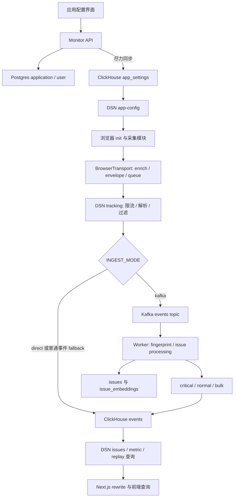
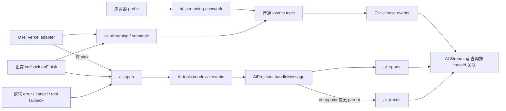

# 前端可观测平台面试：4731e2c5 源码路径与深入回答

目标提交：`4731e2c5125028c6a112bc0c33872705148e279c`，提交时间 2026-03-31，标题 `fix: 🐛 add dedicated web healthcheck endpoint`。核验日期：2026-09-11。

已确认该提交与当前工作区基准 `acdb0884` 在 `apps/`、`packages/`、`.devcontainer/`、`docs/` 中的已跟踪文件没有差异。本文的相关本地代码链接可直接打开阅读；解释以指定提交为准，不以分支未来状态为准。没有切分支，也没有修改业务代码。

**这一版解决的是“能讲出工程实现过程”，而不仅是核对技术名词。** 阅读顺序建议是：先看第一节总路径，再优先练传输、Replay 和 AI；每个主题的“口述答案”可以独立讲，下面的函数路径和追问用于继续展开。

正文将三种内容分开：代码事实有源码引用；设计取舍是对代码结构的解释；时间、ID、分数示例用于演示算法，不是生产测量。你的个人贡献、历史上线与收益数字仍需真实经历支持，不在每段重复免责声明。

## 1. 第一轮先把整体链路讲完整

### 1.1 可以直接讲的项目总述

> 我做的是一套把浏览器错误、性能、现场回放和 AI 请求信息放在一起的可观测平台。我会用“一条错误怎么从页面走到看板”来解释架构。
>
> 浏览器接入入口是 `init`，它根据 DSN 创建统一的 BrowserTransport，再把错误、指标、白屏等采集模块接到这个 transport。错误被捕获后，先补充 release、浏览器和用户上下文，生成 eventId，再按优先级进入内存队列。错误和白屏较早触发发送，普通指标按数量和时间批量调度；页面隐藏或关闭时使用专门的发送策略，可重试失败再进入 IndexedDB。
>
> 服务端由 DSN 接收，先统一解析单条、数组和 Beacon 文本，再做按应用限流、事件过滤和接入模式选择。Kafka 模式下，它把浏览器 payload 转成统一的 Kafka envelope，使用 appId 作为消息 key。Worker 消费后计算 fingerprint，对错误额外处理 issue 元数据，再把事件分成 critical、normal、bulk 三类缓冲写入 ClickHouse。
>
> 查询侧，问题列表按应用、指纹和时间范围聚合事件，前端使用 TanStack Query 管理查询状态，Next.js 的 rewrite 将管理请求和事件查询分别转到 Monitor API 和 DSN。应用和用户等管理信息主要保存在 Postgres。Replay 开关还会同步到 ClickHouse，供 SDK 配置接口读取。
>
> 这里最重要的不是用了多少组件，而是每层有明确职责：采集模块负责生成事实，transport 负责调度和失败补偿，接入层统一协议，Worker 做处理，查询层组织页面需要的数据。不同能力通过 appId、eventId、replayId 和 traceId 关联，但这些 ID 的用途并不相同。

### 1.2 全局路径图



图中的 `issues` 元数据与问题列表不是同一个读路径：**当前列表从 `events` 聚合，不读取完整语义合并关系。** AI 还有独立 topic 与投影表，见第 8 节。

### 1.3 开始之前，先能解释真实初始化参数

下面是按本版本公开类型整理的配置示例，DSN 中的应用 ID 需要换成实际应用；展示了显式配置，不表示每项都需要覆盖默认值。

```ts
import { init } from '@condev-monitor/monitor-sdk-browser'

init({
    dsn: 'http://localhost:8082/dsn-api/tracking/your-app-id',
    release: 'web-2026.03.31',
    dist: 'web',
    transport: {
        queueMax: 10,
        queueWaitMs: 5000,
        enableOffline: true,
        retryMaxCount: 3,
        retryBaseDelayMs: 1000,
        retryBackoff: 2,
        storeMaxItems: 200,
        storeMaxAgeMs: 86400000,
    },
    whiteScreen: {
        wrapperSelectors: ['html', 'body', '#app', '#root'],
        checkDelayMs: 1000,
        maxChecks: 3,
        runtimeWatch: true,
        watchDurationMs: 10000,
        debounceMs: 200,
    },
    replay: {
        bufferMs: 90000,
        maxEvents: 3000,
        beforeErrorMs: 15000,
        afterErrorMs: 10000,
        record: {
            maskAllInputs: true,
            maskTextClass: 'condev-replay-mask',
            recordCanvas: false,
        },
    },
    aiStreaming: {
        urlPatterns: ['/api/chat'],
        stallThresholdMs: 3000,
    },
})
```

| 配置              | 影响哪个环节                                                     | 为什么需要它                                       |
| ----------------- | ---------------------------------------------------------------- | -------------------------------------------------- |
| `dsn`             | 解析 origin、basePath、appId，再推导 tracking/replay/config 地址 | 避免每个 integration 单独配置接收地址              |
| `release`、`dist` | 通用事件上下文、sourcemap 定位                                   | 将线上错误与具体构建产物关联                       |
| `transport`       | 队列、发送、失败补偿                                             | 采集器不需要自己实现 fetch、重试与离线存储         |
| `whiteScreen`     | load 检测及可选运行期检测                                        | 本例主动开启 runtimeWatch；源码默认是关闭          |
| `replay`          | 创建 Replay integration                                          | 还需要服务端应用开关允许，才实际加载 rrweb         |
| `aiStreaming`     | fetch URL 规则、流指标                                           | 本例显式命中 `/api/chat`，与无规则自动识别模式不同 |

`init` 的实际顺序是：单次初始化保护 → `new Monitoring` → `new BrowserTransport` → `monitoring.init(transport)` → Errors/Metrics → 可选 Replay → 默认 RuntimePerformance → 默认 WhiteScreen → 可选 AI streaming。`Monitoring.init` 保存 transport，并把业务传入的 `integrations` 初始化到同一个 transport 上。

依据：[公开参数与 init](../packages/browser/src/index.ts#L30)、[Monitoring.init](../packages/core/src/baseClient.ts#L28)、[DSN 解析](../packages/core/src/dsn.ts#L1)。

**这段最容易被追问：为什么要 integration + transport？**

> 我把“什么时候产生什么事件”和“事件怎么发出去”分开。Errors、白屏、性能各有自己的浏览器 API 和触发条件，但统一依赖 `transport.send`。这样新增一种采集器时可以复用队列、上下文、传输与失败补偿；修改发送策略也不用分别改多个采集器。当前 Core 保存 transport、Browser 实现浏览器传输，属于很直接的依赖分工。

## 2. 浏览器传输：从一条 Error 到失败补发

### 2.1 第一轮口述：说出对象、函数和状态变化

> 浏览器传输这块，我没有把 fetch 写在各个采集器里，而是实现了统一的 BrowserTransport。以 JS 异常为例，Errors 监听捕获阶段的 error 和 unhandledrejection，先产生包含 type、message、stack、path 的原始事件。
>
> `BrowserTransport.send` 先执行入队拦截器，比如 Replay 会在这里给异常挂 replayId；然后 enrichPayload 补 release、dist、browserInfo 和用户上下文。接着 createEnvelope 生成 eventId，记录 clientCreatedAt、category、priority 和 retryCount。这里 envelope 是发送系统的元数据，payload 才是事件内容。
>
> 队列分 immediate 和 batch。错误进入 immediate 后直接请求 flush，普通事件默认累计 10 条或由 5 秒定时器触发，非紧急调度用 requestIdleCallback。真正 drain 时，两条队列会合成一个数组，immediate 在前；所以这是调度和淘汰优先级，不是两个独立网络通道。
>
> Gateway 再将 envelope 转成后端格式，把 eventId 放到 `_eventId`。正常走 fetch，hidden/pagehide 时先尝试 Beacon，再回退 keepalive。500、网络失败等可恢复失败交给 IndexedDB，后台 worker 按到期时间和租约领取，成功删除，失败更新计数与下一次可尝试时间。
>
> 我的设计重点是把队列状态、发送结果和持久化补偿拆开，这样可以解释每个阶段的数据在哪里，以及重试为什么可能重复。当前还有明确边界，比如已经离线时事件只留在内存，发送中再次入队也不保证立刻再 flush；这些不能用“可靠上报”四个字略过。

### 2.2 函数路径：每一步的输入与输出

| 步骤 | 函数与源码                                                                                    | 输入 → 输出/动作                                                                                             |
| ---- | --------------------------------------------------------------------------------------------- | ------------------------------------------------------------------------------------------------------------ |
| 1    | [Errors.init](../packages/browser/src/tracing/errorsIntegration.ts#L16)                       | ErrorEvent / rejection reason → `{event_type:'error', type, message, stack, path}`；资源错误另带 URL/tagName |
| 2    | [BrowserTransport.send](../packages/browser/src/transport/index.ts#L53)                       | 原始事件 → 顺序执行 interceptors，允许附加 replayId                                                          |
| 3    | [enrichPayload](../packages/browser/src/transport/envelope.ts#L35)                            | 事件 → 补 message、browserInfo、release、dist、可选 userId/userEmail                                         |
| 4    | [createEnvelope](../packages/browser/src/transport/envelope.ts#L53)                           | payload → eventId、appId、clientCreatedAt、category、priority、retryCount                                    |
| 5    | [MemoryQueue.enqueue](../packages/browser/src/transport/queue/memoryQueue.ts#L10)             | envelope → immediateQueue 或 batchQueue                                                                      |
| 6    | [FlushScheduler.onEnqueue](../packages/browser/src/transport/scheduler/flushScheduler.ts#L24) | priority/队列长度 → immediate 或 threshold 调度                                                              |
| 7    | [FlushScheduler.flush](../packages/browser/src/transport/scheduler/flushScheduler.ts#L32)     | 检查 flushing/onLine → drain → gateway.send → 可重试失败回调                                                 |
| 8    | [TransportGateway.toWireFormat](../packages/browser/src/transport/gateway/index.ts#L68)       | envelope → payload + `_eventId` + `_clientCreatedAt`；单条是对象，多条是数组                                 |
| 9    | [handleSendFailure](../packages/browser/src/transport/index.ts#L84)                           | 失败批次 → IndexedDB RetryRecord，持久化原 envelope 供重投                                                   |
| 10   | [RetryWorker.tryOnce](../packages/browser/src/transport/offline/retryWorker.ts#L30)           | 到期、未被租用记录 → 领取/发送/删除或更新 nextRetryAt                                                        |

示意事件经历三种形态，省略了与本例无关的字段，ID 和时间仅用于说明：

```text
采集器事件
{ event_type: "error", type: "TypeError", message: "Cannot read...", stack: "...", path: "/exam" }

内存 envelope
{ eventId: "evt-001", appId: "exam-app", clientCreatedAt: 100000,
  category: "error", priority: "immediate", retryCount: 0,
  payload: { event_type: "error", release: "web-2026.03.31", replayId: "replay-001", ... } }

网络 wire payload
{ event_type: "error", release: "web-2026.03.31", replayId: "replay-001", ...,
  _eventId: "evt-001", _clientCreatedAt: 100000 }
```

为什么不把 envelope 直接原样发出去？队列优先级和本地重试次数属于传输实现，服务端当前协议接收事件字段；Gateway 负责边界转换，重投时沿用 eventId。appId 主要在 URL 路径中交给 DSN。

### 2.3 三种“大小”不要说成一个配置

| 设置/状态                         | 实际含义                   | 当前默认/行为                                               |
| --------------------------------- | -------------------------- | ----------------------------------------------------------- |
| `queueMax`                        | batch 的触发阈值           | 10；不是总队列容量，也不是每个请求最多 10 条                |
| 内存队列常量                      | 压力下淘汰策略             | 以总量 500 为目标，仅淘汰 batch；错误积压不受同一硬上限约束 |
| `queueWaitMs`                     | 定时检查 batch 是否非空    | 5000ms；不保证任意事件最多只等待 5 秒                       |
| `beaconMaxBytes`                  | 是否尝试 Beacon 的判断阈值 | 60000，但实现比较 `body.length`，不是 UTF-8 字节            |
| `storeMaxItems` / `storeMaxAgeMs` | worker 清理失败记录的目标  | 200 个批次 / 24 小时；put 不同步执行清理                    |

这就是第一轮可以讲出的设计深度：**“阈值”“容量”“发送大小”“持久化数量”解决的不是同一个问题。**

### 2.4 一个 500 的补偿时间线

假设页面在线可见，SDK 已初始化，以下时间是解释调度的示例：

1. `t=0`：错误入 immediate，flush 先 drain，得到独立批次，发出普通 fetch。
2. `t=0.1s`：服务器返回 500，FetchSender 返回 retryable failure；Gateway 把网络异常也转换成可重试结果。
3. scheduler 调用失败回调，BrowserTransport 异步 put：记录 `retryCount=0`，`nextRetryAt=当前时间+1000ms`，内容是这次失败的 envelope 数组。
4. `nextRetryAt` 到期只表示“允许领取”。worker 每 60 秒轮询，初始化、online 探测后或 visible 事件也可能触发；它不会为每条记录设置精确的一秒定时器。
5. worker 在 IndexedDB readwrite transaction 中领取最多 10 条，写入未来 30 秒的 `leaseUntil`，减少不同标签页同时领取。
6. 如果发送成功，删除对应 record。若仍失败，计数变 1，下一次最早时间为当前时间加 `1000 × 2^1`，即 2 秒；后续为 4 秒、8 秒。
7. 默认条件是递增后 `retryCount > 3` 才删除，因此从 0 开始最多可能有 4 次 worker 尝试；每轮通常遇到首个可保留的失败就停止，避免连续轰击后端。

429 的处理分层：FetchSender 会读取 Retry-After 并设置该实例的内存冷却；**通用** RetryWorker 不使用 `retryAfterMs` 安排持久化记录。ReplayRetryWorker 则有自己的 Retry-After 逻辑，不可混用。

依据：[FetchSender](../packages/browser/src/transport/gateway/fetchSender.ts#L18)、[失败记录存储](../packages/browser/src/transport/offline/failureStore.ts#L1)、[健康探测](../packages/browser/src/transport/offline/networkManager.ts#L46)。

### 2.5 三轮追问：从设计一路问到故障

**追问一：为什么 immediate 会带着普通事件一起发送？**

> drain 会按 immediate、batch 的顺序拼接。这样一次关键错误的发送也能带走已有普通指标，减少请求。优先级的作用是提前触发和优先保留，不是发起多个相互独立的请求；因此不能说错误在网络层绝不会被大批次影响。

**追问二：上一个 fetch 没完成，又来一个错误，怎么处理？**

> 新错误仍会入 immediate，但 flush 看到 `flushing=true` 直接返回，没有在 finally 中主动再 drain。5 秒 timer 又只看 batchSize，所以仅积压 immediate 时可能需要后续入队或生命周期触发才发出去。实际实现有这个延迟边界；如果面试官要求改进，可以提出完成后检查剩余队列，但不能说当前已有。

**追问三：用户本来就离线，事件是否立即写入 IndexedDB？**

> 不是。flush 在 drain 前检查 `navigator.onLine`，离线就返回，事件保留在内存；IndexedDB 主要承接已经尝试发送后的可重试失败。NetworkManager 的 online/visible 回调针对持久化 worker，不是主动 flush 全部内存队列。这与“离线事件一产生就可靠落盘”是两种实现。

## 3. DSN、Kafka、Worker：事件在服务端怎么走

### 3.1 接入端配置不是只设置一个 Kafka 地址

这些是代码读取的参数；可以用于解释配置作用，不应脱离实际部署替用户填生产地址。

| 配置                                             | 默认或部署行为                                | 做了什么                                              |
| ------------------------------------------------ | --------------------------------------------- | ----------------------------------------------------- |
| `DSN_BODY_LIMIT`                                 | 代码 fallback 为 `2mb`；部署环境示例为 `10MB` | DSN 配置 JSON、urlencoded 和 text/plain 解析上限      |
| `RATE_LIMIT_BURST` / `RATE_LIMIT_EVENTS_PER_SEC` | 100 / 100                                     | 单 DSN 实例按 app 的令牌桶容量与每秒补充速率          |
| `INBOUND_MAX_PAYLOAD_BYTES`                      | 524288                                        | 对单条 JSON 事件计算 UTF-8 字节并过滤超限数据         |
| `INGEST_MODE`                                    | 类默认 `direct`；部署 Compose 默认 `kafka`    | 选择直写还是 Kafka 接入                               |
| `KAFKA_ENABLED`                                  | 必须为字符串 `true` 才初始化 producer         | 与 INGEST_MODE 是两个独立条件                         |
| `KAFKA_REQUIRED_ACKS`                            | -1                                            | Producer 发送的确认配置；不是 ClickHouse 落库确认     |
| `KAFKA_PRODUCER_TIMEOUT_MS`                      | 3000                                          | Producer 请求 timeout 配置                            |
| `KAFKA_FALLBACK_TO_CLICKHOUSE`                   | 除非显式 false，否则开启                      | 普通事件/Replay Kafka 发送失败时可以直写；AI 路径另看 |

**为什么 Beacon 文本也能进同一个入口？** DSN 配置了 text/plain body parser，tracking 收到字符串后 JSON.parse；收到对象包装成数组，收到数组则过滤非对象元素。这让客户端的单事件、批量和 Beacon 共用处理入口。[DSN bootstrap](../apps/backend/dsn-server/src/main.ts#L7)、[tracking](../apps/backend/dsn-server/src/modules/span/span.service.ts#L535)

区分代码 fallback 与环境示例时，以 [部署环境示例](../.devcontainer/.env.example#L40) 中的显式设置为准；实际运行值仍取决于如何向服务注入环境变量。

### 3.2 从 HTTP 请求到 Kafka envelope

```text
POST /dsn-api/tracking/:app_id
  → SpanController.tracking
  → RateLimiterService.check(appId, cost)
  → SpanService.tracking
  → InboundFilterService.filter
  → IngestWriterService.writeTrackingBatch
  → KafkaProducerService.publishBatch
```

1. Controller 在解析后的数组上计算请求成本，范围限制为 1–1000，调用令牌桶。超限直接返回 429、Retry-After 与 reset header；这一步先于业务过滤。
2. SpanService 统一输入形态，InboundFilter 检查 event_type、顶层 `user_agent` 的 UA blacklist、release blacklist、单事件 payload 字节数。标准 BrowserTransport 使用的是嵌套 `browserInfo.userAgent`，当前过滤器没有将其映射到顶层；Replay 也走独立入口。因此不能说这条 UA 黑名单已经覆盖标准 SDK 与 Replay 的所有 UA。
3. IngestWriter 先区分结构化 AI 事件与普通事件。对普通事件提取 `event_type/message/sdk_version/environment/release` 等列，把其余上下文留在 `info`。
4. 客户端 `_eventId` 非空时沿用，缺失则由服务端生成。普通事件的初始 fingerprint 为空，留给 Worker 计算。
5. Kafka 模式下转成 `schemaVersion/eventId/appId/eventType/message/info/receivedAt/source` 等字段，逐条序列化。这里一批 SDK 事件可对应 Kafka 的多条 message。
6. Producer 以 appId 为 key，使用 GZIP 压缩 Kafka 消息批次，acks 默认 -1。**这段 Kafka 压缩确实存在，但不是浏览器 Replay HTTP 传输压缩。**

示意映射：

```text
HTTP:  /tracking/exam-app + { _eventId: "evt-001", event_type: "error", message: "...", stack: "..." }
Kafka: { schemaVersion: 1, eventId: "evt-001", appId: "exam-app", eventType: "error", info: { stack: "..." }, ... }
Worker EventRow: { event_id: "evt-001", app_id: "exam-app", event_type: "error", fingerprint: "计算结果", info: {...}, ... }
```

依据：[Controller](../apps/backend/dsn-server/src/modules/span/span.controller.ts#L19)、[令牌桶](../apps/backend/dsn-server/src/modules/ingest/rate-limiter.service.ts#L35)、[入站过滤](../apps/backend/dsn-server/src/modules/ingest/inbound-filter.service.ts#L30)、[envelope 转换](../apps/backend/dsn-server/src/modules/ingest/ingest-writer.service.ts#L53)、[Producer 配置](../apps/backend/dsn-server/src/modules/ingest/kafka-producer.service.ts#L56)。

### 3.3 Worker 为什么还要再分三种缓冲

Worker 启动时连接 Kafka、初始化 DLQ producer、订阅 events/replays/AI 三个 topic，并将每条 lane 的 flush 回调接到 `insertWithRetry`。普通 topic 在 `handleBatch` 中解析 envelope、计算 fingerprint、执行 issue 处理，再调用 `bufferManager.route(row)`；AI topic 单独走投影器。

| Lane     | 路由条件           | 批量触发阈值 | 首条入队后定时触发 | 失败回填容量目标 | 写入尝试配置                |
| -------- | ------------------ | ------------ | ------------------ | ---------------- | --------------------------- |
| critical | error、whitescreen | 10 条        | 100ms              | 10000 条         | 最多 8 次尝试，退避封顶 5s  |
| normal   | 其他普通事件       | 500 条       | 1000ms             | 10000 条         | 最多 5 次尝试，退避封顶 10s |
| bulk     | replay             | 50 条        | 2000ms             | 10000 条         | 最多 5 次尝试，退避封顶 10s |

这些数分别来自 `CRITICAL_*`、`NORMAL_*`、`BULK_*` 环境变量。阈值与时钟触发是为了在请求次数和延迟之间取舍，不是经本次实验证明的最佳参数。浏览器批量减少 HTTP 请求，Worker 批量减少数据库插入，两层服务于不同资源边界。

三条 lane 是同一个 Worker 进程里的 BatchLane 缓冲与调度，不是三个 Kafka partition、独立 consumer group 或硬件资源隔离。

`BatchLane` 的核心不是简单 push 到数组：

1. `add` 将 row 入 buffer，第一条时启动 timer，达到阈值则 await flush。
2. `flushInFlight` 表示已有 flush Promise，避免同一 lane 重复执行同一批写入。
3. `doFlush` 将当前 buffer 交给局部 `rows`，再换成新数组；发送期间新事件可以进入新的 buffer。
4. `flushFn(rows)` 成功，旧批次完成；失败则 `rows.concat(newBuffer)` 回填，保留失败数据在前。
5. 失败回填超过 maxBufferSize 时丢最老部分并记录 lane_overflow，当前该回调只是日志，没有实际发 DLQ。
6. 普通 Kafka batch 结束时还会调用 critical 和非 critical 的 flush，所以实际批次可能没有等到 500 条或 1 秒就被提前写出。

依据：[启动与订阅](../apps/backend/event-worker/src/modules/kafka/kafka-consumer.service.ts#L74)、[lane 配置](../apps/backend/event-worker/src/modules/kafka/batch-buffer-manager.service.ts#L31)、[BatchLane](../apps/backend/event-worker/src/modules/kafka/batch-lane.ts#L46)、[batch 结束 flush](../apps/backend/event-worker/src/modules/kafka/kafka-consumer.service.ts#L263)。

### 3.4 必须纠正：调用提交检查，不等于真的提交 offset

上版将这一段概括为“落库后提交 offset”，不够准确。对指定提交和它锁定的 KafkaJS 2.2.4 深入核验后，真实情况是：

```ts
autoCommit: false
eachBatchAutoResolve: false
```

Worker 每条处理后调用 `resolveOffset`，在末尾 flush 后调用无参数的 `commitOffsetsIfNecessary()`。但 KafkaJS 2.2.4 的这个无参 helper 仅在 `autoCommitInterval` 或 `autoCommitThreshold` 的条件满足时提交；本项目没有配置两者，它们默认均为 null，自动提交又被关闭，所以**该调用路径不会发出实际 OffsetCommit**。

本次用本地 2.2.4 的实际 `OffsetManager.prototype.commitOffsetsIfNecessary` 做了不连接 broker 的隔离检查：interval/threshold 均为 null 时提交调用次数为 0；设置已经到期的 interval 后为 1。这证明 helper 的条件行为，不是全链路 Kafka 故障演练。

口述应改成：

> 代码把本地 offset resolve 和提交检查放在处理及 flush 的对应阶段，设计目标是写入后确认消费。但继续检查 KafkaJS 的实现发现，当前无参条件提交没有配触发阈值，实际 checkpoint 没有由这段代码提交到 broker。因此我能解释这个提交时序的意图，也能指出当前缺口，不能说它已经验证完成。

对“应该如何改”的追问，可回答：应在已确认持久化的连续 offset 范围上执行真正提交，通常提交的是下一条待消费 offset，例如完成 41 后记录 42；同时覆盖写入成功、提交失败、重平衡和毒消息。**这是改进方向，本次未修改 Worker。**

依据：[项目 run 配置](../apps/backend/event-worker/src/modules/kafka/kafka-consumer.service.ts#L106)、[项目提交调用](../apps/backend/event-worker/src/modules/kafka/kafka-consumer.service.ts#L267)、[KafkaJS 2.2.4 Runner](https://github.com/tulios/kafkajs/blob/v2.2.4/src/consumer/runner.js#L308)、[OffsetManager 条件](https://github.com/tulios/kafkajs/blob/v2.2.4/src/consumer/offsetManager/index.js#L200)、[消费说明](https://kafka.js.org/docs/2.2.4/consuming)。

### 3.5 三轮追问

**追问一：为什么 Kafka key 用 appId？**

> 同应用消息在正常相同分区规则下会路由到相同分区，方便保留应用内顺序和局部性。代价是大应用可能形成热点，增加消费者不一定解决单分区吞吐；我不会说它按 fingerprint 并行，也不会把 topic 内顺序扩展成所有 topic 的全局顺序。

**追问二：DLQ 如何让毒消息不阻塞？是不是所有失败都进 DLQ？**

> 无效 envelope 会尝试写 DLQ，成功后 resolve；issue 处理失败也有 DLQ 分支，DLQ 成功时普通事件仍可继续进入 events 写入。DLQ 也失败则保留失败传播或停止处理，以免无声丢弃。lane 溢出只是日志，不属于已经接好的 DLQ。它们是不同错误分支，不能统称“所有异常都兜底”。

**追问三：acks=-1、稳定 eventId 和 ReplacingMergeTree，为什么还不够 exactly-once？**

> acks 是 Kafka producer 的确认层，eventId 是逻辑身份，ReplacingMergeTree 是下游版本归并；它们没有把 Kafka checkpoint 和 ClickHouse 写入变成一个事务。当前还有前述真实提交缺口。应分别验证接入确认、落库、offset 与去重查询，不能把多个“可靠性组件”拼起来就声称端到端 exactly-once。

## 4. 聚合与去重：从原始栈到 issue 元数据

### 4.1 第一轮口述

> 错误聚合我会分成三个对象讲：fingerprint 是确定性分组依据，issueId 是逻辑问题身份，embedding 是候选问题的相似性特征。
>
> Worker 拿到错误先调用 FingerprintService。结构化栈会过滤库帧，取最多八个保留帧，用文件名、函数和可选源码上下文组成签名；原始 stack 走自己的提取分支。缺少可用栈时，再按异常类型加归一化 message 计算 hash。归一化会替换 UUID、时间戳式数字、URL 和一般数字。
>
> 之后 processIssueEvent 从同应用最近二十个开放 issue 中找 fingerprint 精确匹配。未命中时把异常类型、原始 message 和最后一帧函数拼成 embedding 输入，使用 MiniLM 做 mean pooling 和归一化，再与候选向量比较。相似度至少 0.92 选中候选，0.85 到 0.92 的灰区再比较栈签名 TF-IDF，达到 0.8 才接受。
>
> 没选到候选时，用 appId 与 fingerprint 派生确定性 issueId，分别写 issues 和 issue_embeddings；选中时更新 issue 时间。事件本身继续写 events。这里要分清：当前看板按 events 的 fingerprint 聚合计数，并没有把 Worker 语义合并后的 canonical issue 完整接入，所以“有聚合算法”和“产品查询闭环完成”不能混为一谈。

### 4.2 fingerprint 的具体输入、归一化与 hash

实际分支：[FingerprintService.compute](../apps/backend/event-worker/src/modules/fingerprint/fingerprint.service.ts#L7)。

```text
eventType 是 error / whitescreen ?
  是 → extractStackSignature(info)
          有可用签名 → hash(["stack", signature])
          无可用签名 → 有异常类型 ?
                         hash(["type", exceptionType, normalizeMessage(message)])
                       : hash(["message", normalizeMessage(exceptionMessage || message)])
  否 → hash([eventType, normalizeMessage(message)])
```

两条栈路径不要混为一谈：

- 结构化 `frames`：过滤库路径，取数组最后最多 8 帧，以 `filename|function|context_line` 或 `filename|function` 组成签名。这里没有统一把 line/column 纳入指纹。
- 原始 `stack`：按换行拆分，取以 `at ` 开头且非库路径的前最多 8 行。原始行可能含行列和构建路径，跨版本稳定性不能直接继承结构化帧路径的结论。

归一化演示，以下只是字符串变换：

```text
输入：Request 123 failed at https://api.example.test/user/456 time 1710000000000
输出：Request {n} failed at {url} time {timestamp}
```

实际规则执行顺序是 UUID → 10–13 位数字 → URL → 一般数字 → 压缩空白。hash 用 NUL 分隔各部分，做 SHA-256，再截取 32 个十六进制字符。NUL 用于减少直接拼接的分隔歧义。[normalizeMessage 与 hash](../apps/backend/event-worker/src/modules/fingerprint/fingerprint.service.ts#L102)

为什么保留栈？同样一句 `Cannot read properties of undefined` 可能来自不同业务调用点；仅按文本合并会丢掉区分度。为什么归一化有风险？整体替换 URL 会去掉接口路径，数字替换也可能擦掉有意义的错误码。当前规则是具体取舍，不是普适的根因识别。

### 4.3 语义搜索究竟搜索了什么

候选查询包括 `issues FINAL`、同 app、open 状态、`last_seen_at DESC LIMIT 20`，并通过 `argMax(vector, created_at)` 取 issue 的最新向量。先匹配 fingerprint，再计算语义分数，**精确匹配本身也受这二十条候选范围限制**。

embedding 输入不是先把所有文本 normalize 再送模型，而是：

```text
异常类型 | 原始 message | 最后一帧的 function
```

模型默认为 `Xenova/all-MiniLM-L6-v2`；调用 feature-extraction pipeline 时使用 `pooling:'mean'` 和 `normalize:true`。对已归一化向量，余弦相似度可以通过点积计算；向量为空或维度不匹配时返回 0。模型初始化失败会停用语义能力，保留其他处理路径。

演示候选判断：某候选 embedding 分数 0.94，则直接选中；分数 0.88 时才进入 TF-IDF，若为 0.82 则选中，若为 0.70 则不选。**这些是演示分数，不是实测准确率；0.94 也不代表有 94% 的概率同根因。**

依据：[候选 SQL 与判断](../apps/backend/event-worker/src/modules/kafka/kafka-consumer.service.ts#L286)、[输入拼接](../apps/backend/event-worker/src/modules/fingerprint/fingerprint.service.ts#L125)、[模型执行](../apps/backend/event-worker/src/modules/fingerprint/embedding.service.ts#L17)。

### 4.4 TF-IDF 不是“再让另一个模型判断一次”

输入是当前与候选的 `stack_signature.split('\n')`，不是通用自然语言分组服务。处理顺序为：

1. 栈行转小写，按非 `[a-z0-9_./:-]` 字符拆词，去掉长度不大于 1 的 token。
2. 按 appId 维护文档数和 token 的 document frequency；每次比较会先登记两份文档。
3. `TF = 某词出现次数 / 当前文档总词数`。
4. `IDF = ln((文档数 + 1) / (包含该词的文档数 + 1)) + 1`。
5. token 权重是 TF×IDF；在两个稀疏向量的词项并集上计算余弦。

这种权重让频繁共同出现的栈特征区分力较低，稀有特征更有影响。但统计是进程内在线累积，最多维护 200 个 app 和每 app 50000 个 token，重启、淘汰和不同实例的统计历史会改变结果。它不是固定人工标注验证集训练出的模型。

依据：[TF-IDF 完整实现](../apps/backend/event-worker/src/modules/fingerprint/tfidf.service.ts#L12)。

### 4.5 issueId、events、issues：三个层面的去重

| 对象               | 身份/排序键                                                  | 实际负责什么                                    |
| ------------------ | ------------------------------------------------------------ | ----------------------------------------------- |
| 浏览器 `eventId`   | 每个通用事件生成，重投沿用                                   | 标识同一次事件；重复请求仍可能携带相同 ID       |
| `fingerprint`      | 从内容规则确定                                               | 标识分组特征；不是事件唯一 ID                   |
| `issueId`          | SHA-256(appId + NUL + fingerprint) 再格式化                  | 相同 app 和 fingerprint 产生相同逻辑 issue 身份 |
| `events`           | `(app_id, event_type, event_id)`，版本 received_at，按月分区 | 保存事件事实；ReplacingMergeTree 进行版本归并   |
| `issues`           | `(app_id, issue_id)`，版本 updated_at                        | 保存问题元数据；不提供传统唯一索引              |
| `issue_embeddings` | `(app_id, issue_id, created_at)`，普通 MergeTree             | 保存向量版本，查询选择最新                      |

新 issue 写入 `occurrence_count=1` 并写 embedding；已有 issue 分支更新 `last_seen_at/updated_at`，没有执行计数加一。`upsertIssues` 的名字是应用层命名，内部执行的是 ClickHouse insert，不是关系数据库 `ON CONFLICT`。[新建与更新](../apps/backend/event-worker/src/modules/kafka/kafka-consumer.service.ts#L342)、[Writer](../apps/backend/event-worker/src/modules/clickhouse/clickhouse-writer.service.ts#L73)、[DDL](../.devcontainer/clickhouse/init/002_issue_tables.sql#L3)

LLM 是后处理：每小时选取低事件量 orphan issue，先 embedding≥0.86、TF-IDF≥0.8，再询问 LLM；确认后将 source 标记 merged 并填 `merged_into`，另有每天 3 点的标题任务。这不是给每条事件调用大模型，也不是已经形成了人审反馈训练闭环。[LLM 任务](../apps/backend/event-worker/src/modules/llm/issue-merge-job.service.ts#L64)

### 4.6 三轮追问

**追问一：两个不同 fingerprint 被语义合并，事件是否都改成 canonical fingerprint？**

> 当前 processIssueEvent 选中 issue 后更新元数据，但没有把 EventRow.fingerprint 改为所选 issue 的 fingerprint，也没有把 canonical issueId 写到该事件行。因此 events 按 fingerprint 查询时仍可能展示为两个分组。这正是需要继续接查询闭环的原因，不能因为 Worker 找到了 chosen 就认为产品已统一。

**追问二：不同消费者都写同一个 issueId，ReplacingMergeTree 怎样选版本？**

> 依据相同 ORDER BY 键和版本列归并，查询使用 FINAL 时获得对应归并视图。它不是全字段自动合并，比如两个版本的 first_seen/last_seen 不会天然取最小最大，需要写入方正确组织字段；相同版本的冲突也不能解释为严格事务顺序。

**追问三：为什么没有将所有灰区都交给 LLM？**

> 确定性和轻量相似度先控制在线处理成本，LLM 另用定时任务处理候选。这样避免每条事件都依赖模型响应时延。当前主路径仍会等待 embedding/issue 查询，所以不是“完全无额外成本”；要证明成本收益，还要测模型初始化、单事件处理和候选查询耗时。

## 5. Replay：不是背四个时间参数，而是讲清一个窗口

### 5.1 第一轮口述

> Replay 我分为启用、录制、触发、裁剪和回放五个阶段。SDK 传 replay 选项后会创建集成，但不会立即加载 rrweb；bootstrap 先请求 DSN 的 app-config，应用开关允许才动态加载 rrweb，再开始录制。
>
> 录制阶段维护有限事件数组，默认按 90 秒和 3000 条两个条件淘汰，rrweb 每 10 秒做 checkout，为短窗口提供新的 FullSnapshot。输入默认 mask，canvas 默认关闭。这里我记录的是 DOM 快照和增量事件，不是视频帧。
>
> 触发点设在 transport 入队之前。error 或带 failureStage 的 AI streaming 事件经过拦截器时，创建 pendingUpload，里面保存 replayId、错误时间、窗口起止时间和定时器；replayId 同时挂到错误上。默认等错误后 10 秒再上传，同一个 pending 期间的新错误复用这个 ID，不重新开一个窗口。
>
> 上传时不是直接切错误前 15 秒的数组，而是先找目标起点之前最近的 FullSnapshot，再把它到窗口结束的事件组织出来，尝试补上 Meta。这样做是因为后面的 DOM 增量依赖已有节点和镜像状态。payload 包括 replayId、startedAt、endedAt、errorAt 和 events，使用独立 fetch 路径；失败补偿也有独立 store 和 worker。
>
> 服务端再次检查应用开关，限制事件数量后写入；前端按 appId、replayId 查询，用 rrweb-player 播放，根据 errorAt 减首个事件时间得到跳转偏移。这样错误事件和现场回放在数据上能关联。当前裁剪是容量控制，超限时可能破坏增量链，所以不能直接等同于完整还原保证。

### 5.2 完整调用路径

```text
browser.init({ replay: ... })
  → new Replay(...).init()
  → bootstrap()
      → 初始化 ReplayStore / ReplayRetryWorker
      → GET /dsn-api/app-config?appId=...
      → replayEnabled 为 true 后 loadRrweb()
      → patchTransport() + startRecording()
  → rrweb emit(event) → push(event)
  → error 进入 BrowserTransport.send
      → addBeforeEnqueue 拦截器
      → 创建 pendingUpload，给错误加 replayId
  → timer 到期或 pagehide → flushPending()
      → pickEvents() → withMetaFirst() → JSON.stringify
      → postReplay()；离线/可重试失败 → saveToStore()
  → POST /dsn-api/replay/:appId
      → SpanService.replayUpload() → normalizeReplayEvents()
      → IngestWriter.writeReplay() → Kafka replay topic 或直写
  → Worker bulk lane → events → 兼容物化视图
  → GET /dsn-api/replay?appId=...&replayId=...
  → ReplayPlayer → RRWebPlayer → goto(errorOffset, true)
```

依据：[bootstrap](../packages/browser/src/replay/replayIntegration.ts#L142)、[拦截器](../packages/browser/src/replay/replayIntegration.ts#L202)、[录制](../packages/browser/src/replay/replayIntegration.ts#L257)、[上传](../packages/browser/src/replay/replayIntegration.ts#L349)、[服务端](../apps/backend/dsn-server/src/modules/span/span.service.ts#L1209)、[回放查询](../apps/backend/dsn-server/src/modules/span/span.service.ts#L1261)、[播放器](../apps/frontend/monitor/components/replay/ReplayPlayer.tsx#L29)。

### 5.3 用时间线说明为什么要 FullSnapshot

假设在 `t=80s、90s、100s` 各有一份 FullSnapshot，缓冲里也保留着其间增量，`t=100s` 出错。

```text
目标窗口：                   [85s ---------------- 110s]
可用快照：              F80          F90       F100
实际选取：              [F80 + 后续事件 ------------ 110s]
错误位置：                                     E100
播放器跳转偏移：约 100 - 80 = 20 秒，实际按首个返回事件计算
```

1. `windowStart=100-15=85`，`windowEnd=100+10=110`。
2. 优先选时间不晚于 85 的最近 FullSnapshot，即 F80；不能因为 F90 更近就优先选它，否则丢失 85–90 的目标上下文。
3. 如果 F80 不在缓冲里，算法才退回缓冲中的第一份 FullSnapshot，实际覆盖范围可能变短。
4. 在 t=104 再报错时，复用 pending replayId，窗口仍结束于 110，不延长到 114。
5. 若 t=103 已 pagehide，则立即 flush，endedAt 为 103；不存在页面关闭后继续补录到 110。
6. 上传时如果为了上限只保留 FullSnapshot 与最后一段 tail，中间节点创建或修改事件可能丢失，所以仍需验证回放内容。

“为什么必须完整增量链”的回答可以具体到：快照中没有节点 N，后面先发生新增 N，再发生修改 N；若裁剪掉新增而保留修改，播放器就缺少修改对象。只保住第一份快照不能自动修复缺失事件。

### 5.4 参数实际控制哪个成本

| 参数/代码配置                            | 本版值                                  | 作用与代价                                                     |
| ---------------------------------------- | --------------------------------------- | -------------------------------------------------------------- |
| `bufferMs`                               | 默认 90000，最低覆盖 before+after+10000 | 给触发前上下文留空间；事件条数可能更早成为限制                 |
| `maxEvents`                              | 默认 3000，配置最小 500                 | 限制浏览器缓冲事件数量，不保证固定字节内存                     |
| `beforeErrorMs` / `afterErrorMs`         | 15000 / 10000                           | 目标前后窗口，后窗口带来等待时间                               |
| `checkoutEveryNms`                       | 10000，录制处固定                       | 增加可用基线，也增加大快照成本                                 |
| `maskAllInputs`                          | true                                    | 输入内容掩码；不等于全 DOM 文本掩码                            |
| `recordCanvas`                           | false                                   | 减少较重录制，但 canvas/Three.js 内容不能据此保证还原          |
| `inlineImages` / `collectFonts`          | true / true                             | 收集更多还原所需内容，也会增加成本；不是默认所有项都最轻       |
| `mousemoveWait`                          | 50                                      | 传给 rrweb 的移动采样配置                                      |
| `upload.keepalive` / `keepaliveMaxBytes` | true / 60000                            | 以 body.length 判断是否开启 keepalive，没有 HTTP 压缩和 Beacon |
| `upload.retryCount`                      | 1                                       | 初次 postReplay 最多可进行两次尝试，不是整个生命周期总次数     |
| ReplayStore 清理目标                     | 20 条 / 24 小时                         | 保存或 worker 清理时生效，不是严格 TTL 和多标签页原子上限      |
| 服务端 events 上限                       | 2000                                    | 保护入口与存储，不证明回放语义保持完整                         |

服务端限制的独立 `snapshot` 字符串是另一个可选字段，上限 500000 字符；当前浏览器 Replay payload 主要发送 `events`，不能把这个限制说成 FullSnapshot 节点内容已被准确截断到相同字节大小。

### 5.5 回放查询也要知道读的是哪张表

本版 `replayGet` 按 appId + replayId，从 `base_monitor_view` 查询最近一条。新事件先写入 `events`，再通过兼容物化视图进入旧存储和旧视图。因此说“Replay 都存在 ClickHouse”还不够深，要能说明写入新表、兼容视图和读取路径的关系。[兼容视图 DDL](../.devcontainer/clickhouse/init/001_condev_monitor_schema.sql#L39)

播放器会先验证事件数组并按 timestamp 排序，再创建 RRWebPlayer。错误跳转偏移是 `max(0, errorAt - firstEvent.timestamp)`，不是固定跳到第 15 秒；因为为了快照，真正起点可能早于目标窗口。[偏移计算](../apps/frontend/monitor/components/replay/ReplayPlayer.tsx#L56)

### 5.6 三轮追问

**追问一：录制不开启时会不会把 rrweb 放进所有页面？**

> Replay integration 由 SDK 参数控制，rrweb 的动态加载还要等服务端 replayEnabled。bootstrap 初始化失败缓存与 worker 在开关查询之前，但录制和 transport 拦截器是在开关允许、rrweb 加载成功后才启用。关闭录制与不初始化任何相关逻辑不是完全一样的概念。

**追问二：客户端开关已经查过，为什么服务端上传还检查？**

> 客户端持有的状态可能陈旧，也不能作为服务端唯一判断。上传和读取都会重新查 Replay 配置；关闭时上传返回 skipped、读取返回空。当前 SDK 没有周期性重新拉开关来停止已开始的录制，因此服务端关闭并不等于所有已打开页面立即停止本地采集。

**追问三：同一份 Replay 重传会不会被 eventId 去重？**

> BrowserTransport 普通事件的 eventId 和 Replay 的 replayId 不能混用。Replay 上传由服务端用空 event_id 转成新 UUID，同一 replayId 的重投可能有不同 event_id。读取最近一份可以给出一个视图，但不是物理事件行唯一保证；回放质量和重复存储需要分别验证。

## 6. 白屏与性能：把浏览器 API 的作用说准确

### 6.1 白屏第一轮口述

> 白屏不一定伴随 JS 异常，因此我单独做了视口采样。初始化时等 document load 或 readyState complete，再延迟一秒开始轮询。每次按视口宽高计算九个采样坐标，用 elementFromPoint 取得最上层命中元素，再检查它是不是 html、body、配置的 app/root 容器，或者没有命中。
>
> 九点全部命中容器才认为是白屏候选，最多检查三次，但不是连续三次投票；第一次命中也会报告。事件里会带上 reason、每个采样点的坐标、元素选择器和 isWrapper，方便排查依据，而不是只发一个布尔值。
>
> 对 SPA 运行中白屏，我提供 runtimeWatch。开启后，click、popstate、hashchange，以及包装后的 pushState/replaceState 会打开十秒检测窗口；MutationObserver 监听 DOM 变化，但只在窗口内 debounce 二百毫秒再检查。包装 history 时先调用原方法，保留返回值并派发内部事件，避免把路由能力和具体框架耦合。
>
> 首次上报后 hasReported 变为 true，并断开 Observer，抑制同一个实例反复报警。这套机制有确定的证据和成本边界，但它判断的是 DOM 命中结构，不是最终画面语义。骨架屏、白色遮罩或空 div 不一定能识别，所以不会声称已经覆盖所有视觉白屏。

### 6.2 白屏检查的函数路径

```text
WhiteScreen.init
  → readyState complete ? startAuto : 等待 load
  → setTimeout(checkDelayMs)
  → startPolling('auto')
  → checkAndReport(reason)
  → check()
      → 计算九点坐标
      → document.elementFromPoint(x, y)
      → 空命中 / html / body / 精确命中配置 wrapper ?
      → pointResults.every(point => point.isWrapper)
  → 首次命中：hasReported=true，teardownRuntimeWatch()
  → transport.send({ event_type:'error', type:'whiteScreen', reason, result, path, at })
```

注意最后的真实事件类型：当前白屏模块发的是 `event_type:'error'`、`type:'whiteScreen'`。因此它走通用错误 immediate，并进入 Worker 的 error 分支；服务端 Replay 开关允许、rrweb 加载成功且异步入队拦截器已经安装后，它还能触发 Replay。早期发生的白屏可能早于这几个步骤，不能保证必有录制。也不能凭模块名另造一个 `event_type:'white_screen'` 来讲这条实际路径。

依据：[初始化与轮询](../packages/browser/src/tracing/whiteScreenIntegration.ts#L123)、[报告 payload](../packages/browser/src/tracing/whiteScreenIntegration.ts#L179)、[九点计算](../packages/browser/src/tracing/whiteScreenIntegration.ts#L307)。

### 6.3 运行期监听的时间关系

```text
pushState(...)
  → 调用原 history.pushState.apply(history, args)
  → dispatch '__condev_monitor_history_change__'
  → armRuntimeWatch('history', 10000)
      armedUntil = Date.now() + 10000

随后 DOM mutation
  → Observer callback
  → isRuntimeArmed() && !hasReported
  → 清除上一次 mutation timer
  → 200ms 后 checkAndReport('mutation:history')
```

只打开窗口本身不等于必然立即检查：route/click 主要 arm，后续 mutation 才安排这条检测。手动 `triggerWhiteScreenCheck(reason)` 会调用 trigger 直接检查。Observer 默认关闭；开启后未报告前可持续挂载，“只在十秒内调度”与“只挂十秒就断开”不同。

为什么 patch pushState/replaceState？这两个调用不会由本代码自动变成 popstate，单听浏览器前进后退不能覆盖应用主动导航，所以需要包装并发送统一内部事件。patch 标记避免重复包装，但整体 init/销毁能力仍需分别检查，不能靠标记推导为全生命周期完全无泄漏。

依据：[路由包装](../packages/browser/src/tracing/whiteScreenIntegration.ts#L236)、[arm 状态](../packages/browser/src/tracing/whiteScreenIntegration.ts#L277)、[手动触发 API](../packages/browser/src/index.ts#L22)。

### 6.4 三轮追问

**追问一：怎么选九个点，为什么不用递归遍历所有 DOM？**

> 九点覆盖中心、四角附近与边缘中部，按相对坐标计算，降低一次检查的成本；elementFromPoint 直接看当前视口命中对象，而不是遍历整个树。代价是采样有盲区，也不检查像素颜色和内容语义。

**追问二：骨架屏算正常还是异常？把它加进 wrapper 就能解决吗？**

> 当前没有加载态时限和 skeleton 分类器。普通 skeleton 元素可能让某个点被判断为有效内容，从而漏报；加为 wrapper 又可能让正常加载被算成白屏。需要结合业务加载状态与超时才有更好的判断，但这属于扩展方案，不能说本版已有自动豁免。

**追问三：Performance API 在你的白屏算法中做了什么？**

> 这份白屏算法没直接使用 Performance API。真正用它的是单独的运行性能集成：longtask、事件循环延迟和 FPS。它们也可以提供排障上下文，但当前没有把这些指标融合成白屏评分模型。

### 6.5 性能采集被追问时，用公式回答

| 能力      | 代码机制                                                          | 默认参数与上报条件                                                         |
| --------- | ----------------------------------------------------------------- | -------------------------------------------------------------------------- |
| Long task | PerformanceObserver 观察 longtask，支持检测与旧签名回退           | duration≥50ms，发送 `performance/longTask`                                 |
| Jank      | 每 50ms 用 performance.now 取样，算 `当前 - 上次 - 50ms`          | 漂移≥100ms 计一次，每 5000ms 有异常才上报 count、lagAvg、lagMax            |
| FPS       | requestAnimationFrame 累计帧数，约一秒算 `帧数×1000/实际窗口毫秒` | 小于45且累计到连续2个低帧率窗口时上报 `performance/lowFps`                 |
| 生命周期  | hidden 停止 jank/FPS，visible 恢复                                | 避免把后台定时器节流简单当成前台卡顿；longtask 监听不由同一 pause 方法关闭 |

这些都通过 BrowserTransport 走 batch，默认的 `event_type:'performance'` 和 `type` 子类要分清。长任务表示单次任务长，jank 是取样回调延迟，FPS 是帧回调频率；不能把三者当同一个指标，也不能说只靠它们自动定位到了某个 React 组件。

依据：[运行性能默认与初始化](../packages/browser/src/tracing/runtimePerformanceIntegration.ts#L57)、[LongTask](../packages/browser/src/tracing/runtimePerformanceIntegration.ts#L113)、[Jank](../packages/browser/src/tracing/runtimePerformanceIntegration.ts#L157)、[FPS](../packages/browser/src/tracing/runtimePerformanceIntegration.ts#L214)。

## 7. 应用配置、隐私与问题查询：哪些规则在哪里生效

### 7.1 Replay 开关从管理界面走到 SDK

```text
useApplications.updateMutation({ id, replayEnabled })
  → PUT /api/application
  → Next.js rewrite → Monitor API
  → ApplicationService.update
      → 查当前用户拥有的 application
      → 修改 replayEnabled，save 到 Postgres
      → 尝试 syncReplaySetting 到 ClickHouse app_settings
  → onSuccess 更新前端 ['applications'] 查询缓存

SDK Replay.bootstrap
  → GET /dsn-api/app-config?appId=...
  → SpanService.getAppConfigFlags
      → app_settings 按 updated_at DESC 取一条
      → 未命中/异常时请求 Monitor public/config
  → replayEnabled → 决定是否加载与开始录制
```

这里可以把三种状态讲清：管理数据库保存状态、ClickHouse 副本状态、浏览器已经加载的状态。UI 更新缓存只更新界面视图，不会自动刷新已经打开的所有 SDK 实例；Postgres save 和 ClickHouse insert 也不是一个跨库事务。

`syncReplaySetting` 通过新行写入，表用 ReplacingMergeTree(updated_at)，排序键 app_id。`nextAppSettingsUpdatedAt` 查询最新秒级版本，如果当前时间没有更晚就加一秒，目的是让顺序更新尽量有更大的版本；但“先查再写”不是并发原子发号。同步失败只记录错误，不回滚 Postgres。

依据：[前端 mutation](../apps/frontend/monitor/hooks/use-applications.ts#L85)、[应用 update](../apps/backend/monitor/src/application/application.service.ts#L106)、[版本与同步](../apps/backend/monitor/src/application/application.service.ts#L264)、[DSN 读取](../apps/backend/dsn-server/src/modules/span/span.service.ts#L203)。

**第一轮口述**

> 应用配置这块，我把管理写入与 SDK 读取分开。界面通过 application API 改 Replay 开关，服务端先确认应用归属并保存 Postgres，再把需要高频读取的开关同步到 ClickHouse app_settings。浏览器通过 DSN 的 app-config 获取配置，不需要额外直接访问管理 API。
>
> 读取时按 appId 取最新版本，副本没有数据或查询失败时回退管理端 public config。这样复用了 DSN 的接入域名与已有 ClickHouse 查询能力，但这是尽力同步，不是缓存失效协议。要判断开关是否真正生效，必须分别检查 Postgres、app_settings 和 SDK 初始化状态，而不能只看界面按钮已经变了。

### 7.2 隐私：设置不是重点，设置在哪个边界生效才是重点

| 数据路径             | 设置/处理位置                            | 实际做了什么                               | 没有覆盖什么                               |
| -------------------- | ---------------------------------------- | ------------------------------------------ | ------------------------------------------ |
| rrweb 输入           | `record({maskAllInputs:true})`           | 将输入掩码交给录制层，在事件生成时处理     | 普通 DOM 文本、URL、用户字段               |
| rrweb 敏感文本与区域 | maskTextClass、blockClass、blockSelector | 接入方指定文本掩码或整块屏蔽               | 没标记的业务敏感区域                       |
| 通用事件             | enrichPayload                            | 补用户、版本等上下文，本身不是通用脱敏器   | 自定义 payload 中的秘密或私人数据          |
| Vercel OTel 语义输出 | capturePrompt、captureToolCalls          | 对相应语义字段显式开启才输出               | 手动 fallback 中的 input、其他独立采集路径 |
| DSN InboundFilter    | event_type、UA、release、大小过滤        | 拒绝部分不合规则的事件                     | 不递归扫描所有敏感字段                     |
| LLM issue 任务       | LLM_BASE_URL/provider、模型调用          | 把错误 message 与部分 stack 送往所配置端点 | 不由业务 AI 的 capturePrompt 开关控制      |

可用的 SDK 配置是 `replay.record`；服务端初始化的相应隐私选项可以这样显式表达，API 来自现有 `CondevServerOptions`：

```ts
import { registerCondevServer } from '@condev-monitor/nextjs/server'

await registerCondevServer({
    privacy: {
        capturePrompt: false,
        captureToolCalls: false,
    },
})
```

**第一轮口述**

> 隐私控制我会按数据经过的边界来讲。Replay 的输入掩码在 rrweb record 时传入，敏感区域用 class 或 selector 做过滤；这样对应的原始输入不会先进入这条录制事件流，再等服务端处理。AI 的 prompt 和 toolCalls 由语义适配器的隐私选项控制，默认不主动开启。
>
> 我还会检查其他字段有没有绕过这些设置。比如通用事件会补 userId/userEmail，Replay 上传体也可能带用户标识和 URL；Next.js 的错误 fallback 会记录自己的 input。它们不一定走 rrweb 掩码或 OTel prompt 开关。因此我把这些描述为特定采集路径的默认控制，不称为一个覆盖所有字段的动态脱敏中心。验证时要看实际 payload、失败缓存和存储中的数据，而不只是配置值。

依据：[rrweb 配置](../packages/browser/src/replay/replayIntegration.ts#L119)、[AI adapter 隐私](../packages/ai/src/adapters/vercel.ts#L93)、[fallback input](../packages/nextjs/src/server.ts#L177)、[服务端选项](../packages/nextjs/src/server.ts#L13)。

### 7.3 问题列表如何从 ClickHouse 变成页面

1. `BugsPage` 根据认证与应用选择决定 query 是否 enabled，queryKey 包含 appId、range、from、to，防止不同范围误用同一缓存键。
2. queryFn 请求 `/dsn-api/issues`，Next.js rewrite 转发给 DSN；TanStack Query 是前端查询状态/缓存管理，不等于服务端独立查询引擎。
3. `SpanService.issues` 将时间范围解析成秒和桶间隔，使用 query_params 传 appId、时间边界、interval、limit。
4. SQL 从 events 取 error 事件；有 fingerprint 用原值，没有则构造 legacy fingerprint。先按应用/指纹/类型/message/path/时间桶计数，再按应用/指纹聚合。
5. `argMax` 选代表字段，sum 汇总次数，min/max 取首末出现时间；返回桶列表后，服务端补完整时间轴中的空桶。
6. API 输出 `{id, appId, type, message, path, events, firstSeenAt, lastSeenAt, trend}`，页面用于问题列表和趋势图。

依据：[前端 query](../apps/frontend/monitor/app/bugs/page.tsx#L146)、[Next.js rewrite](../apps/frontend/monitor/next.config.ts#L6)、[聚合 SQL](../apps/backend/dsn-server/src/modules/span/span.service.ts#L823)。

### 7.4 三轮追问

**追问一：为什么 app_settings 能保证最新值？**

> 它只能按已有副本版本选最新行，不能证明比 Postgres 新，也没有检查副本新鲜度。顺序写入时版本递增有帮助，跨库同步失败和并发更新仍有边界。public config 还会尝试读 ClickHouse，因此不能把它描述成完全独立的 Postgres 兜底。

**追问二：既然做了字段过滤，能证明邮箱不会上传吗？**

> 不能从 InboundFilter 推出这个结论。它没有做通用敏感字段遍历，而 enrichPayload 明确会补 userEmail。要证明不上传，需要追踪产生、转换、缓存、发送各阶段，使用合成邮箱实际验证对应路径，不能只看服务端最终 SELECT 没有返回该字段。

**追问三：为什么不用 issues.occurrence_count 直接画趋势？**

> 当前该字段并没有持续累加，而且单个总数也不足以表达任意时间范围内的趋势。events 保存具体发生记录，查询时按桶计算才能随窗口变化。问题是当前这条 SQL 没有消费完整语义合并关系，也没有在所有计数处强制去重；这是准确解释查询结果时必须知道的限制。

## 8. AI：把 /api/chat 的一次请求从浏览器追到查询表

### 8.1 第一轮口述

> AI 这块我会直接用仓库里的 Next.js RAG 示例来讲。客户端 instrumentation-client 注册监控，把 `/api/chat` 配成流式请求规则，并设置三秒 stall 阈值；服务端 instrumentation 注册 OTel SpanProcessor 和 AI SDK 集成。真正的 chat route 使用 streamTextResponseWithCondev，而不是只在页面发个 traceId 就结束。
>
> 浏览器的 patched fetch 对命中请求生成 traceId，在同源或明确允许的 origin 下增加 x-condev-trace-id。服务端包装器从请求头继承这个 ID，再放进 Vercel AI telemetry metadata，并保留 sessionId、userId。它还包装工具 execute、onError 和 onAbort，为工具失败、请求失败与取消补充结构化事件。
>
> 浏览器收到 response 后，业务仍拿原始响应，探针读 clone 的流。它记录首次网络 chunk、流结束时间、字节数、chunk 数和间隔；这里读的是字节块，没有解析模型 token。服务端 OTel 适配器在 span 结束时读取 model、provider、usage 等属性，并通过 sink 发结构化 ai_span。
>
> 后端并不是把这些都塞一张表。网络 ai_streaming 走普通 events；结构化 ai_span 被 DSN 分到 AI topic，Worker 的 AiProjector 写 ai_spans，被投影器判定为根的 span 再写 ai_traces，具体条件是 entrypoint 或 parent 为空、缺失。Dashboard 同时查 network events、ai_traces 和 span 状态，按 traceId 合并。所以关联需要同一个 ID，也需要正确的事件类型和投影路径，只有 ID 一样还不够。

### 8.2 真正的接入文件在哪里

| 层             | 仓库入口                                                                                    | 实际设置/调用                                                                            |
| -------------- | ------------------------------------------------------------------------------------------- | ---------------------------------------------------------------------------------------- |
| Next.js 客户端 | [instrumentation-client.ts](../examples/aisdk-rag-chatbox/src/instrumentation-client.ts#L1) | registerCondevClient；urlPatterns 为 `/api/chat`，stallThresholdMs 为3000，replay true   |
| Node 服务端    | [instrumentation.ts](../examples/aisdk-rag-chatbox/src/instrumentation.ts#L1)               | 在 Node runtime 调用 registerCondevServer                                                |
| AI 业务请求    | [chat route](../examples/aisdk-rag-chatbox/src/app/api/chat/route.ts#L62)                   | 从会话取 user/session；streamTextResponseWithCondev 包装模型、messages、tools            |
| 客户端封装     | [nextjs/client.ts](../packages/nextjs/src/client.ts#L19)                                    | DSN 来自参数或 NEXT_PUBLIC_CONDEV_DSN，调用 React/Browser init                           |
| 服务端注册     | [nextjs/server.ts](../packages/nextjs/src/server.ts#L395)                                   | DSN 按配置优先级读取；创建 sink、Vercel adapter、processor，并注册 telemetry integration |
| 请求包装器     | [createCondevAIRequestContext](../packages/nextjs/src/server.ts#L167)                       | 继承请求 trace ID，设置 metadata、AbortSignal、错误/工具回调                             |

客户端真实示例只有下面这些配置，不要为它补造跨域部署事实：

```ts
import { registerCondevClient } from '@condev-monitor/nextjs/client'

registerCondevClient({
    aiStreaming: {
        urlPatterns: ['/api/chat'],
        stallThresholdMs: 3000,
    },
    replay: true,
})
```

### 8.3 header 是怎样真正变成 telemetry metadata 的

服务端核心语句如下，保留了关键路径，其他上下文在实际函数中继续补充：

```text
createCondevAIRequestContext(options)
  traceId = request.headers.get(traceIdHeader) 的有效值，缺失则生成 UUID
  stream(streamOptions) 返回新的 options：
    abortSignal = streamOptions.abortSignal ?? request.signal
    experimental_telemetry.isEnabled = true
    experimental_telemetry.metadata.condevTraceId = traceId
    condevSessionId / condevUserId 按存在情况加入 metadata
    tools.execute、onError、onAbort 被包装，继续调用原有逻辑

streamTextResponseWithCondev
  → streamText(condev.stream(stream))
  → result.toUIMessageStreamResponse()
```

这回答“你怎样保证前后端关联”的关键点：**不是 header 一加就自动被 OTel 看见，而是服务端包装器显式转成 adapter 会读取的属性。** adapter 的读取字段是 `ai.telemetry.metadata.condevTraceId`，或者指定请求头对应的 span attribute；没有就不生成该适配输出。

跨域需要同时满足目标 URL 命中、允许该 origin、服务端 CORS 允许该请求头；没有显式 URL 规则的自动 SSE 检测模式不注入 header。自定义 condevTraceId 是平台关联键，不能等同于 W3C traceparent。

失败采集也有模式差异：fetch reject 的 `failureStage:'network'` 只在显式 urlPatterns 模式上报。自动模式拿不到 response 时无法通过 Content-Type 判断是否为 SSE，不能把显式 `/api/chat` 示例的失败覆盖扩展到所有自动检测请求。

### 8.4 network probe：每个指标从哪里算出来

```text
fetch 开始：startedPerf = performance.now()
获取 response：复制 clone，业务拿原 response
循环 reader.read()：
  第一块 → firstChunkAt
  每块 → gap = now - lastChunkAt
  非首块且 gap > stallThresholdMs → stallCount++
  chunkCount++，totalBytes += value.byteLength
  达到字节/块数限制 → 停止 probe
结束/异常处理后：endedPerf = performance.now()
```

| 字段             | 实际公式/口径                            | 面试时的解释                                        |
| ---------------- | ---------------------------------------- | --------------------------------------------------- |
| sseTtfb          | firstChunkAt - startedPerf；无块为 -1    | 首个网络 chunk 等待，非严格首 token                 |
| sseTtlb          | endedPerf - startedPerf                  | 探测结束耗时，需看 complete / probe_limit 等原因    |
| chunkCount       | read 得到的块数量                        | 不等于 SSE 消息数，也不等于 token 数                |
| totalBytes       | Uint8Array.byteLength 累加               | 与 body.length 的字符串判断不同，这里是实际读取字节 |
| stallCount       | 非首块且 gap>3000ms 的次数               | 下一块到达后才确认前一段间隔，非独立 watchdog       |
| stallTotalMs     | 被判为 stall 的整个 gap 累加             | 不是只累加超出3000ms的那一部分                      |
| maxChunkInterval | 所有 gap 的最大值                        | 当前实现可能包含首块之前的等待                      |
| failureStage     | http / network / stream                  | 传输/读取阶段，不等于模型内部根因                   |
| completionReason | complete / probe_limit / stream_error 等 | 探针达到限制不代表用户请求失败                      |

默认探测限制为 50000 个 chunk 或 10×1024×1024 字节。它们只在 read 返回后检查，没有独立时长 watchdog。取消 clone 的 reader 与取消业务请求不同；clone 分支消费速度不同也可能增加内存成本，因此不能说“绝对无侵入、零开销”。

依据：[SSE fetch 包装](../packages/browser/src/tracing/sseTraceIntegration.ts#L28)、[probe](../packages/browser/src/tracing/sseTraceIntegration.ts#L181)、[配置默认](../packages/browser/src/tracing/sseTraceTypes.ts#L1)。

### 8.5 两种语义输出、两条 topic，别混成一句“AI 事件都进 AI topic”



`IngestWriter` 的 AI 分类集合包括 `ai_span`、`ai_observation`、`ai_feedback`、`ai_ingestion_run`、`ai_evaluation`，**不包括 `ai_streaming`**。因此网络记录和 generic semantic 都留在普通链路。

Vercel OTel adapter 在 onEnd 做两件事：

1. `reporter.send` 一条 `ai_streaming/type:ai_semantic/layer:semantic`，包含上游提供的模型、usage、finishReason、部分时间与受开关控制的内容。
2. 如果传入 sink，另行 `sink.emit(toObservationEvent(...))`，输出结构化 `ai_span`。当前该映射 status 固定 ok，字段并不等于前一条 semantic 对象的完整复制。

正常的 AI SDK callback `onFinish` 也会输出 generic semantic 和结构化 span；请求包装器的 error/cancel/tool fallback 则输出结构化错误或状态事件。图中将它们分开，是因为它们的字段与投影行为不同。[callback 输出](../packages/ai/src/integrations/vercel-ai-sdk.ts#L194)

Next.js 注册函数创建 `VercelAIAdapter(sink)`，这是实际让结构化输出进入 AI 投影的接法。**裸 adapter 只有 generic semantic 时，不能认为当前 AI Streaming 页一定能关联到它。** 当前查询的语义数据来自 `ai_traces` 和 `ai_spans`，不是回头读取全部 generic semantic。

NodeReporter 与 BrowserTransport 也不同：它管理正在发送的 Promise 集合，send 直接 HTTP POST，flush 等待 pending promises；没有浏览器那套 IndexedDB 和持久化重试。不能因为后端共用 DSN，就推导两种 SDK 有相同投递能力。

依据：[adapter 双输出](../packages/ai/src/adapters/vercel.ts#L63)、[NodeReporter](../packages/ai/src/reporter.ts#L27)、[DSN 分类](../apps/backend/dsn-server/src/modules/ingest/ingest-writer.service.ts#L23)、[AI 分支消费](../apps/backend/event-worker/src/modules/kafka/kafka-consumer.service.ts#L151)。

### 8.6 一条 ai_span 怎么变成 ai_traces

`AiProjector.handleMessage` 对 ai_span/ai_observation 先调用 upsertSpan；如果 `spanKind==='entrypoint'`，或 parentSpanId 为空/缺失，再调用 upsertTrace。

这里的“根”是这段代码的判定结果，不一定等于完整 OTel 树中的真实根：当前 Vercel OTel adapter 的结构化映射没有带 parentSpanId，spanKind 为 llm，也会因 parent 缺失满足投影条件。不能仅凭 `ai_traces` 有行就认定父子关系已经完整保留。[OTel 映射](../packages/ai/src/adapters/vercel.ts#L120)

字段转换示例：

```text
SDK 字段                     ClickHouse 列
traceId                      trace_id
spanId / parentSpanId         span_id / parent_span_id
appId                        app_id
sessionId / userId            session_id / user_id
inputTokens / outputTokens   input_tokens / output_tokens
startedAt / endedAt          started_at / ended_at
durationMs                   duration_ms
metadata                     JSON.stringify 后的 metadata
```

根 trace 写入时还会根据 model/provider/token 数与定价配置计算估计成本。它是计算出的估计值，不能等同于模型供应商最终账单；token 字段缺失时，当前写入会有相应默认值，不能把默认 0 当成已准确测量。

依据：[投影分支](../apps/backend/event-worker/src/modules/ai-observability/ai-projector.service.ts#L82)、[trace 写入与成本](../apps/backend/event-worker/src/modules/ai-observability/ai-projector.service.ts#L107)、[span 写入](../apps/backend/event-worker/src/modules/ai-observability/ai-projector.service.ts#L160)。

### 8.7 用“工具失败”走完一条异常路径

真实 chat 示例识别输入中的 `/fail tool`，使用会主动抛错的 searchKnowledgeBase tool；`/fail provider` 则选择故意无效的模型名。这提供了源码里的故障演示入口，本次没有调用真实模型执行它们。

工具失败路径：

1. `createCondevAIRequestContext.stream` 包装 tool 的 execute，保存原函数后 await 调用。
2. 捕获抛出的 error，调用 emitToolError，产生 `spanKind:'tool'`、`status:'error'`、parentSpanId 指向请求 trace 的事件。
3. emitToolError 还会调用 emitError，为请求产生 entrypoint error；这让工具失败不只有孤立子事件，也有请求层状态。
4. 然后重新 throw 原错误，继续走业务 AI SDK 的错误语义。`toolErrorReported` 用于避免 onError 又重复补同一类根错误。
5. 结构化事件通过 NodeReporter → DSN → AI topic → projector，工具 span 写 ai_spans，entrypoint 写 ai_traces。
6. AI Streaming API 并行查 network、语义 trace/状态和统计，再用 traceId Map 关联；页面只有检测到语义 trace 状态时才给出详情跳转。

如果工具内部自己 catch 异常并返回普通字符串，外层 execute 包装器不会收到 throw，因此不能保证所有“语义上失败”的工具都被标为 error。这是个可以具体回答的第三轮问题，而不是只说“覆盖工具调用失败”。

依据：[示例故障入口](../examples/aisdk-rag-chatbox/src/app/api/chat/route.ts#L52)、[tool 包装](../packages/nextjs/src/server.ts#L259)、[tool/root 事件](../packages/nextjs/src/server.ts#L226)、[查询与关联](../apps/backend/dsn-server/src/modules/span/span.service.ts#L1433)、[详情入口](../apps/frontend/monitor/app/ai-streaming/page.tsx#L617)。

### 8.8 三轮追问

**追问一：为什么要同时采浏览器 network 和服务端 span？**

> 浏览器看到用户侧请求与字节到达，服务端看到模型、工具和 token。浏览器无法凭字节知道模型用了多少 token，服务端 span 也不能独自反映客户端读流异常。两层保留各自计时，再通过关联键组合；不直接用两台机器的绝对时间相减当网络耗时。

**追问二：浏览器 HTTP 200，但 AI trace 标 error，是矛盾吗？**

> 不矛盾。响应头可能已经成功发出，之后工具或模型流才失败。transport 的 HTTP/stream 状态与语义执行状态是不同维度。当前查询会结合 trace 和 span 状态，不能只看 statusCode；同样 probe_limit 只是监控探测停止，不能自动判模型失败。

**追问三：我只有 network 行，没有语义 trace，你如何沿代码排查？**

> 依次查：客户端是否显式命中 URL 并实际发出 header；请求到 API route 后是否保留同一 ID；是否使用 wrapper 写 telemetry metadata；server registration 是否拿到 DSN 并装好集成；adapter 是否提供 sink；是否产生 root ai_span；DSN 是否分进 AI topic；Worker 是否写 ai_spans/ai_traces；最后检查 query 的 appId、时间范围和 traceId。按这个顺序能定位缺哪一跳，不会一上来就怀疑模型。

## 9. Sourcemap 与复盘：再加一层前端工程深度

### 9.1 Sourcemap 不只是安装 trace-mapping

```text
构建生成匹配版本的 sourcemap
  → Monitor SourcemapController 接收上传
  → 校验应用权限或上传 token
  → SourcemapService 将文件写到受控目录
  → Postgres 保存 appId/release/dist/minifiedUrl/mapPath 索引
  → 错误查询时 DSN 找到匹配 mapPath
  → 加载并缓存 TraceMap
  → originalPositionFor 查原始 source/line/column/name
  → 从 sourcesContent 组织源码片段
  → 页面展示 resolvedFrames
```

上传 token、索引和版本匹配是这项工程能力的重要部分。只讲“用库还原行列号”会漏掉：哪个版本的 map、从哪取得、部署后谁能读取、权限如何控制、错误里怎样带 release/dist。

第一轮可说：

> 我为压缩代码排障补了 sourcemap 的管理与查询链路。构建产物需要带 release 和 dist，上传时将 map 文件和应用、版本、压缩 URL 建立索引。DSN 查询错误时，根据这些维度加载对应 map，用 TraceMap 映射原位置，并返回源码片段给错误详情。这样功能不只停留在浏览器拿到一段压缩栈，而是能让排查人员看到匹配构建的原始位置。

依据：[上传 controller](../apps/backend/monitor/src/sourcemap/sourcemap.controller.ts#L24)、[文件与记录](../apps/backend/monitor/src/sourcemap/sourcemap.service.ts#L103)、[索引查询](../apps/backend/dsn-server/src/modules/span/span.service.ts#L380)、[错误详情形态](../apps/frontend/monitor/app/bugs/page.tsx#L41)。

### 9.2 三轮追问

**追问一：为什么不能只按 JavaScript 文件名找 map？**

> 同名文件可能对应不同应用和发布，映射必须关联 app、release、dist 和压缩 URL。映射错版本可能返回貌似合理但错误的源码位置，比明确缺失还难排查。

**追问二：Monitor 上传成功，DSN 为什么还找不到文件？**

> 元信息在 Postgres，文件在文件系统，两者可访问性不同；多实例部署还要看两个服务是否看到相同存储目录、路径和权限。数据库里有 mapPath 不能证明 DSN 实例能 readFile。

**追问三：sourcemap 会自动让 fingerprint 跨版本稳定吗？**

> 不会。当前错误查询还原与 Worker 指纹计算是两条路径，Worker 并没有自动先对全部堆栈做同样符号化。要让原始源码参与指纹，需要真正接入归一化流程并验证版本行为；不能将查看详情的能力推导成聚合算法已完成的能力。

## 10. 用这些材料练第一轮，而不是背函数名

### 10.1 一项亮点讲到什么深度才够

每项至少讲出以下六件事，通常比继续增加技术名词更有效：

1. **触发入口**：谁调用了哪个公开 API，或者哪个浏览器事件触发。
2. **关键配置**：两三个真实参数，分别控制什么；为什么不是同一个限制。
3. **数据状态**：原始事件、envelope、持久化记录、表行分别是什么。
4. **主路径**：用一次具体错误或请求串联四到六个核心函数。
5. **失败路径**：在哪里决定可重试，状态如何保存，下一次由谁触发。
6. **取舍与一个边界**：说明为什么这样设计，然后主动交代最关键的限制即可。

第一轮不要把整张函数表照读。可以先讲每节的口述答案，让面试官知道你能串起实现；当对方问“具体怎么做”，再拿出表中的字段、时间线和代码分支。

### 10.2 三种 ID 的现场抽查

| 面试官问法                            | 准确回答                                                                                                      |
| ------------------------------------- | ------------------------------------------------------------------------------------------------------------- |
| eventId 和 fingerprint 都是 hash 吗？ | 不是。通用 eventId 通常是 randomUUID；fingerprint 从内容规则派生；一个指纹可以对应很多次发生的事件            |
| replayId 是 eventId 吗？              | 不是。一次录制窗口的 ID，可由同窗口多个错误共享；Replay 接收端 event_id 又另行生成                            |
| traceId 与 spanId 有什么关系？        | traceId 关联一次请求/执行上下文，spanId 标识其中一个片段，parentSpanId 表达树关系；不能用同一字段代替所有语义 |
| 有一个 ID 就能关联所有页面吗？        | 还必须看 appId、事件类型、存储表、查询范围和 UI 是否消费对应字段                                              |

### 10.3 不再重复浅回答：四组替换

| 只讲概念              | 能体现实现过程的说法                                                                                                                      |
| --------------------- | ----------------------------------------------------------------------------------------------------------------------------------------- |
| 我做了队列和重试      | 我在 send 中 enrich 并创建 envelope，immediate/batch 分开入队；flush drain 后失败写 RetryRecord，worker 用 nextRetryAt 和 leaseUntil 领取 |
| 我用了 rrweb 回放     | 我在 transport 入队拦截器建立 pendingUpload，给错误挂 replayId；以错误时间算窗口，回退到起点前 FullSnapshot，再用 errorAt 计算播放器偏移  |
| 我用了 embedding 聚合 | 我先查同 app 最近20个 open issue，在候选内精确匹配；MiniLM 输出归一化向量，灰区按栈行生成 TF-IDF，最后决定新建或更新                      |
| 我把 AI 前后端打通了  | 客户端给命中请求加 header，服务端 wrapper 写 telemetry metadata；sink 发 ai_span，AI topic 投影 ai_traces，查询按 traceId 关联网络行      |

## 11. 本次核验与仍需实测的事项

- 固定了用户指定提交，并核对相关代码与工作区一致；原有面试稿的事实核验和本稿的源码讲解相互补充，Kafka offset 结论以本稿第 3.4 节为准。
- 跟踪了 Browser init、普通错误/失败补偿、DSN 接入、Kafka producer/consumer、三类 lane、指纹/embedding/TF-IDF、Replay、白屏、配置、隐私、AI 双路投影与查询、sourcemap。
- 实际执行了 KafkaJS 2.2.4 条件提交 helper 的隔离检查，证明 null 条件不会调用 commit；未连接 broker，不是 Kafka/ClickHouse 端到端验证。
- 未执行生产请求、模型调用、全栈运行、浏览器性能压测或隐私审计；不从实现代码推导吞吐、成功率、聚合准确率或排查效率的百分比。
- 本文的代码片段用于展示当前公开 API 或注明省略的调用过程；示例 appId、时间和分数不是线上数据。
